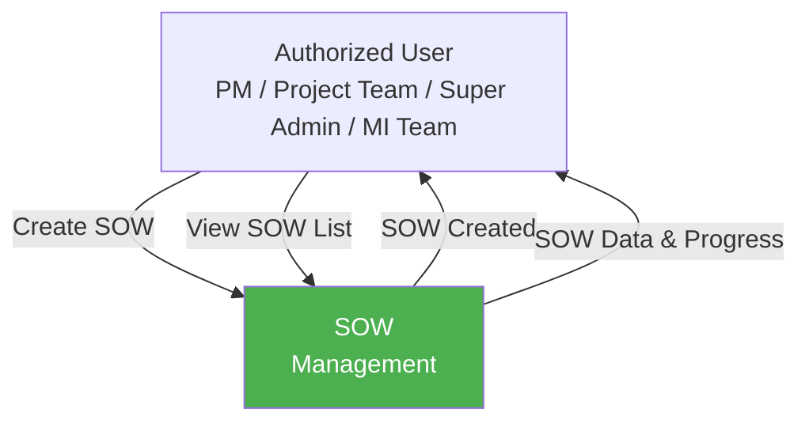
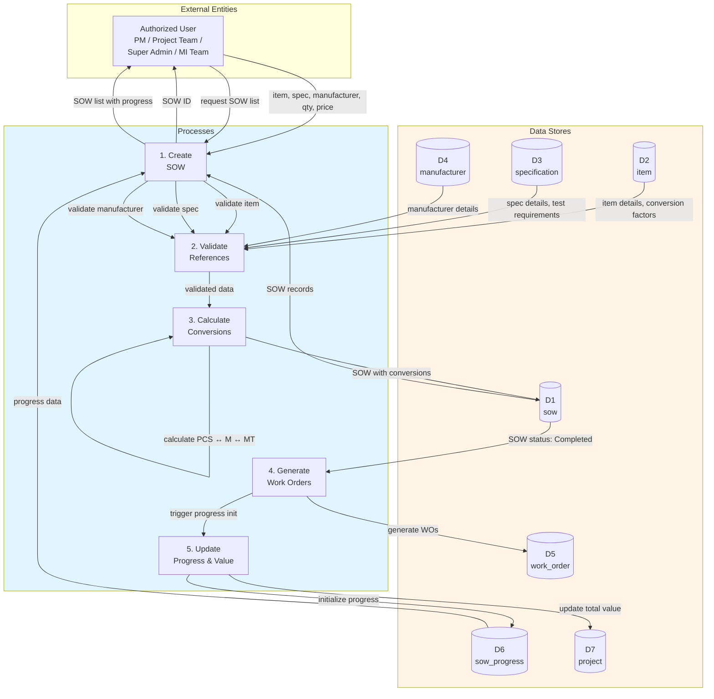
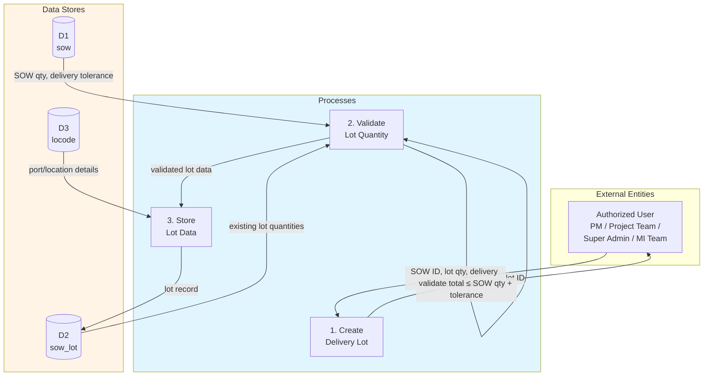
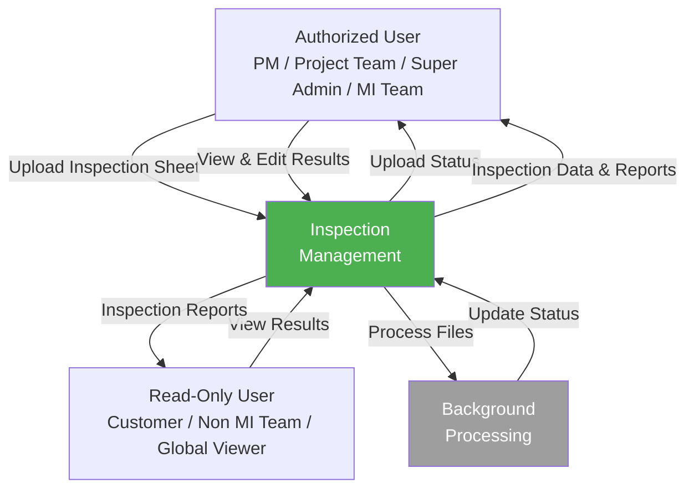
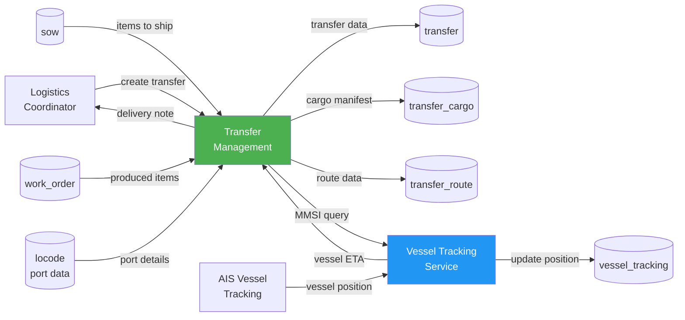
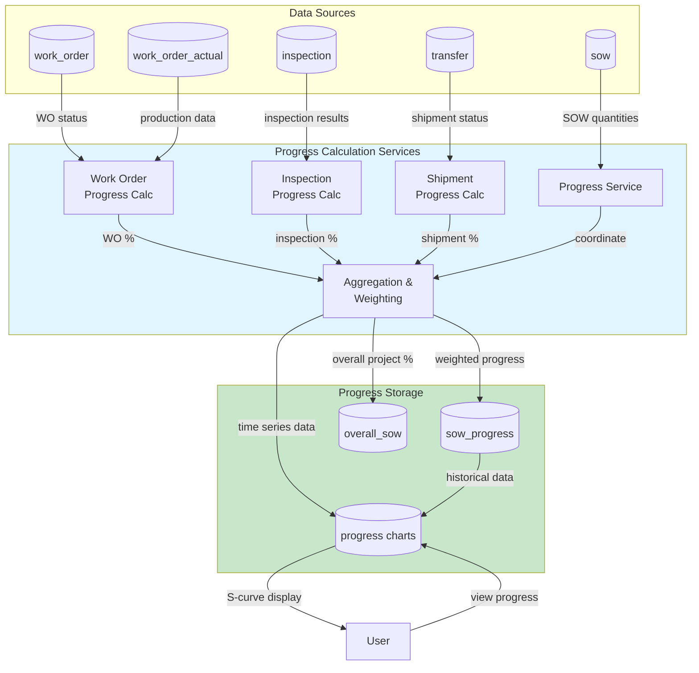
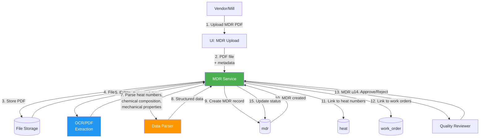
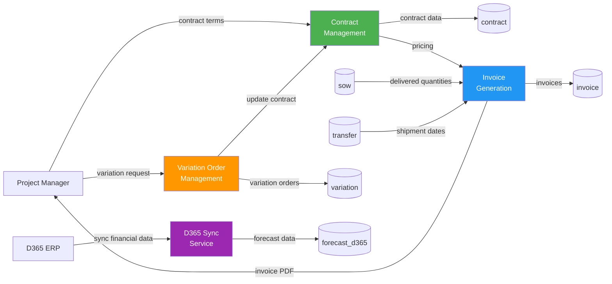
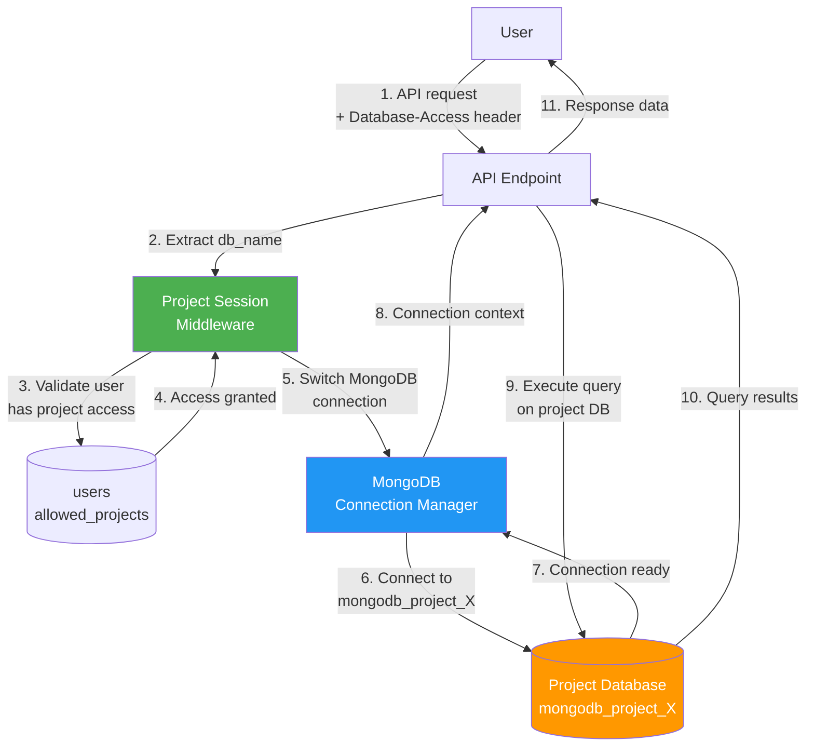

# 7. Data Flow Diagrams

This section illustrates the flow of data through the Pipeline system using hierarchical Data Flow Diagrams (DFD). Level 0 diagrams provide high-level overviews, while Level 1 diagrams show detailed process interactions.

**Diagram Conventions:**
- **External Entities**: Users, vendors, external systems (rectangles)
- **Processes**: System functions and business logic (rounded rectangles)
- **Data Stores**: Database collections (cylinders/parallel lines)
- **Data Flows**: Movement of data between components (arrows)

---

## 7.1 System Overview - Data Flow Diagram Level 0


*Figure 1: Pipeline System - Level 0 Data Flow Diagram*

---

## 7.2 SOW Management - Data Flow Diagram Level 0

### 7.2.1 SOW Management - Data Flow Diagram Level 0

This image represents a Level 0 Data Flow Diagram (DFD) for the main process of SOW (Scope of Work) Management in Pipeline. It outlines the key interactions between users and the system, showing how data flows between entities and the SOW management process.

This diagram illustrates the SOW Management process in Pipeline, showing how data flows between key roles and the system. **Authorized Users** (Project Manager, Project Team, Project Team BU/MISI/Non-MI, Super Admin, MI Team) initiate the process by creating SOW records that define contract line items with specifications, quantities, and pricing. The **System** validates the data against master references and automatically generates work orders when SOW is submitted.

The SOW Management process ensures proper contract definition and work order generation by receiving, validating, and storing SOW data. It interacts with global master data (items, specifications, manufacturers), creates delivery lots, and triggers downstream processes including work order generation, progress tracking initialization, and project value calculations.



*Figure 2: SOW Management - Level 0 DFD*

---

### 7.2.2 SOW Management - Data Flow Diagram Level 1

This Data Flow Diagram (DFD) level 1 visualizes the SOW management process in Pipeline, depicting the flow of data between users, processes, and databases. It offers a more detailed view compared to the Level 0 diagram above. The image below presents the DFD for Pipeline's SOW process.



*Figure 3: SOW Management - Level 1 DFD*

The key components are explained in the table below.

**Table 7.2: SOW Management Data Flow Diagram Level 1 Key Components**

| No. | User | Input | Process | Output |
|-----|------|-------|---------|--------|
| 1 | Authorized User (Project Manager, Project Team, Project Team BU/MISI/Non-MI, Super Admin) | Item ID, Specification ID, Manufacturer ID, Quantity (with unit: PCS/M/MT), Unit price, Delivery tolerance, MTO item number, Customer item number | **Create SOW**: Receives SOW form data, validates user privileges (SCOPE_OF_WORK = RW), validates form completeness, checks for duplicate SOW (same item + manufacturer + spec + quantity), sets status to "Submitted" or "Completed" based on form completion | New SOW record created with unique ID, form_status (Complete/Incomplete), status (Submitted/Completed) |
| 2 | System (Laravel) | SOW data with reference IDs | **Validate References**: Validates item exists in D2 (`item`), validates specification exists in D3 (`specification`), validates manufacturer exists in D4 (`manufacturer`), retrieves conversion factors from item master | Validated SOW data with item details (type, name, OD, grade), spec details (test requirements), manufacturer details (short name) |
| 3 | System (Laravel) | Validated SOW data, item conversion factors | **Calculate Conversions**: Calculates quantity conversions between units (PCS ↔ M ↔ MT) using item-specific conversion factors, generates full item description by concatenating item attributes, calculates total price (qty × unit_price), validates delivery tolerance | SOW record stored in D1 (`sow`) with qty_pcs, qty_m, qty_mt, conversion factors, desc (full description), total_price |
| 4 | System (Laravel) | SOW ID with status "Completed" | **Generate Work Orders**: If SOW status is "Completed", automatically generates work orders for manufacturing and coating (if applicable), creates work order records with references to SOW, manufacturer, and specifications, triggers transfer tracking initialization | Work orders created in D5 (`work_order`) with id_sow reference, status "New", stage "production" or "coating" |
| 5 | System (Laravel + Artisan) | SOW ID, Work Order IDs | **Update Progress & Value**: Initializes progress tracking record in D6 (`sow_progress`) with schedule: 0%, actual: 0%, recalculates project total value by summing all completed SOW total_price, triggers Artisan commands: `generate:forecast`, `progress:chart`, `adjust:overalls` | Progress record created in D6, project total_value updated in D7 (`project`), forecast and progress charts generated |

---

## 7.3 SOW Lot Management - Data Flow Diagram Level 1

SOW Lot Management is a sub-process of SOW Management that handles the breakdown of SOW items into delivery lots with specific delivery terms, destinations, and schedules.



*Figure 4: SOW Lot Management - Level 1 DFD*

**Table 7.3: SOW Lot Management Key Components**

| No. | User | Input | Process | Output |
|-----|------|-------|---------|--------|
| 1 | Authorized User (Project Manager, Project Team, Project Team BU/MISI/Non-MI, Super Admin) | SOW ID, Lot quantity (with unit), Delivery term (Incoterm: DDP/CIF/FOB), Destination port/location, Delivery schedule date | **Create Delivery Lot**: Receives lot form data, validates user privileges (SCOPE_OF_WORK = RW), validates SOW exists and is in "Completed" status | Lot form ready for validation |
| 2 | System (Laravel) | Lot quantity, SOW reference | **Validate Lot Quantity**: Retrieves SOW quantity and delivery tolerance from D1, retrieves all existing lot quantities from D2, calculates total allocated quantity, validates: total_lot_qty ≤ SOW_qty + delivery_tolerance | Validation result (pass/fail) |
| 3 | System (Laravel) | Validated lot data | **Store Lot Data**: Retrieves port/location details from D3 (`locode`), creates lot record with id_parent (SOW ID), delivery_term, destination, qty, delivery_date | Lot record stored in D2 (`sow_lot`) with unique ID, linked to parent SOW |

---

## 7.4 Inspection Management - Data Flow Diagram Level 0

### 7.4.1 Inspection Management - Data Flow Diagram Level 0

This image represents a Level 0 Data Flow Diagram (DFD) for the main process of Inspection Management in Pipeline. It outlines the key interactions between users and the system, showing how data flows between entities and the inspection process.

This diagram illustrates the Inspection Management process in Pipeline, showing how data flows between key roles and the system. **Authorized Users** (Project Manager, Project Team, Project Team BU/MISI/Non-MI, Super Admin, MI Team) initiate the process by uploading inspection sheets with test data, which is then processed in the Inspection Management system. **Read-Only Users** (Customer, Non MI Team, Global Viewer) can view inspection results and progress reports, while the **System** handles background processing of uploaded files.

The Inspection Management process ensures proper tracking and validation by receiving, processing, and storing inspection data. It interacts with all key stakeholders, ensuring that inspection sheets are uploaded systematically, test results are validated against specifications, and necessary updates are communicated to maintain quality control and compliance.



*Figure 5: Inspection Management - Level 0 DFD*

### 7.4.2 Inspection Management - Data Flow Diagram Level 1

This Data Flow Diagram (DFD) level 1 visualizes the inspection management process in Pipeline, depicting the flow of data between users, processes, and databases. It offers a more detailed view compared to the Level 0 diagram above. The image below presents the DFD for Pipeline's inspection process.

```mermaid
graph TB
    subgraph Users["External Entities"]
        AUTH_USER[Authorized User<br/>PM / Project Team /<br/>Super Admin / MI Team]
        VIEWER[Read-Only User<br/>Customer / Non MI Team /<br/>Global Viewer]
    end

    subgraph Processes["Processes"]
        P1["1. Upload<br/>Inspection Sheet"]
        P2["2. Create<br/>Queue & Mapping"]
        P3["3. Trigger<br/>Processing Job"]
        P4["4. Process Data<br/>(Python Script)"]
        P5["5. View<br/>Inspection Results"]
    end

    subgraph DataStores["Data Stores"]
        D1[(D1<br/>inspection)]
        D2[(D2<br/>queue_file)]
        D3[(D3<br/>test_raw)]
        D4[(D4<br/>testing)]
        D5[(D5<br/>testing_table)]
        D6[(D6<br/>work_order)]
        D7[(D7<br/>specification)]
    end

    AUTH_USER -->|Excel file, WO ID, test type| P1
    P1 -->|inspection number| AUTH_USER

    P1 -->|inspection metadata| D1
    D6 -->|WO details, stage| P1

    P1 -->|trigger mapping| P2
    P2 -->|file path, mapping config| D2
    P2 -->|raw Excel data| D3

    P2 -->|dispatch job| P3
    P3 -->|execute Python script| P4

    D2 -->|queue data, mapping| P4
    D3 -->|raw test data| P4
    D7 -->|spec limits, test types| P4

    P4 -->|validated test results| D4
    P4 -->|merged table data| D5
    P4 -->|update status: completed| D2
    P4 -->|update metadata| D1

    AUTH_USER -->|request inspection data| P5
    VIEWER -->|request inspection data| P5
    D1 -->|inspection records| P5
    D4 -->|test results| P5
    D5 -->|table data| P5
    P5 -->|inspection report (RW)| AUTH_USER
    P5 -->|inspection report (R)| VIEWER

    style Processes fill:#e1f5ff
    style DataStores fill:#fff4e6
```

*Figure 6: Inspection Management - Level 1 DFD*

The key components are explained in the table below.

**Table 7.1: Inspection Management Data Flow Diagram Level 1 Key Components**

| No. | User | Input | Process | Output |
|-----|------|-------|---------|--------|
| 1 | Authorized User (Project Manager, Project Team, Project Team BU/MISI/Non-MI, Super Admin) | Excel file with test data, Work Order ID, Test type (e.g., Product Analysis, Hydrostatic, Dimensional) | **Upload Inspection Sheet**: Validates user privileges (PROJECT_CONTROL = RW), validates work order exists, creates new inspection record with status "pending", stores uploaded file to storage (S3/local) | New inspection record stored in D1 (`inspection`) with metadata (inspection_type, id_wo, id_manufacturer, stage, uploaded_by) |
| 2 | System (Laravel) | Excel file, mapping configuration (data range, title row, column mapping) | **Create Queue & Mapping**: Imports raw Excel data using `InspectionMappingImport`, stores mapping configuration, creates queue file with status "pending" | Raw Excel rows stored in D3 (`test_raw`), queue record created in D2 (`queue_file`) with file path and mapping config |
| 3 | System (Laravel Queue) | Queue ID, database name | **Trigger Processing Job**: Dispatches `ProcessInspectionScript` job to queue (medium priority), job executes Python script with queue parameters | Laravel job dispatched, Python script executed asynchronously |
| 4 | System (Python Script) | Queue data from D2, raw test data from D3, specification limits from D7 | **Process Data (Python Script)**: Reads raw data, validates against spec limits, calculates pass/fail for each test, merges data from multiple uploads by matching pipe_no/heat_no, generates testing and testing_table records | Validated test results stored in D4 (`testing`), merged table data in D5 (`testing_table`), queue status updated to "completed" in D2, inspection metadata updated in D1 |
| 5 | Authorized User (RW) or Read-Only User (R) | Inspection ID, Work Order ID, Test type filter | **View Inspection Results**: Validates user privileges (PROJECT_CONTROL = RW or R), retrieves inspection records with test results, generates tables and graphs with pass/fail statistics, provides Excel export functionality | Inspection report with pass/fail results, statistical analysis, heat number traceability, and downloadable Excel export (Authorized users can also edit/delete records) |

---

## 7.5 Transfer & Logistics - Data Flow Diagram Level 0



*Figure 5: Transfer & Logistics - Level 0 DFD*

---

## 7.6 Progress Tracking - Data Flow Diagram Level 1



*Figure 6: Progress Tracking - Level 1 DFD*

---

## 7.7 MDR Management - Data Flow Diagram Level 1



*Figure 7: MDR Upload & Processing - Level 1 DFD*

---

## 7.8 Commercial Operations - Data Flow Diagram Level 0



*Figure 8: Commercial Operations - Level 0 DFD*

---

## 7.9 Authentication & Authorization Flow

```mermaid
graph TB
    USER[User] -->|1. Email + Password| LOGIN[Login API]

    LOGIN -->|2. Validate credentials| USER_DB[(users)]
    USER_DB -->|3. User found| LOGIN

    LOGIN -->|4. Check password hash| BCRYPT[Bcrypt Verify]
    BCRYPT -->|5. Password valid| LOGIN

    LOGIN -->|6. Generate tokens| PASSPORT[Laravel Passport]
    PASSPORT -->|7. Create access token| TOKEN_DB[(oauth_access_tokens)]
    PASSPORT -->|8. Create refresh token| REFRESH_DB[(oauth_refresh_tokens)]

    TOKEN_DB -->|9. Access token| PASSPORT
    PASSPORT -->|10. JWT tokens| LOGIN
    LOGIN -->|11. Auth response<br/>{access_token, refresh_token}| USER

    USER -->|12. API request<br/>+ Bearer token| API[Protected API]
    API -->|13. Verify token| PASSPORT
    PASSPORT -->|14. Query token| TOKEN_DB
    TOKEN_DB -->|15. Token valid + user_id| PASSPORT

    PASSPORT -->|16. Load user| USER_DB
    USER_DB -->|17. User data + role| PASSPORT

    PASSPORT -->|18. Check privilege| PRIV[Privilege<br/>Middleware]
    PRIV -->|19. Authorized| API
    API -->|20. Response data| USER

    style LOGIN fill:#4CAF50,color:#fff
    style PASSPORT fill:#2196F3,color:#fff
    style PRIV fill:#FF9800,color:#fff
```

*Figure 9: Authentication & Authorization - Level 1 DFD*

---

## 7.10 Multi-Tenancy Database Routing



*Figure 10: Multi-Tenancy Database Routing - Level 1 DFD*

---

## Notes

- All data flows include implicit error handling and validation not shown in diagrams for clarity
- Database transactions ensure ACID compliance for critical operations (SOW creation, invoice generation, etc.)
- Caching layers (Redis/Laravel Cache) are used for frequently accessed reference data (not shown)
- File uploads go through queue processing for large files (MDR PDFs, inspection photos)
- Progress calculations run on-demand and are cached with invalidation triggers
