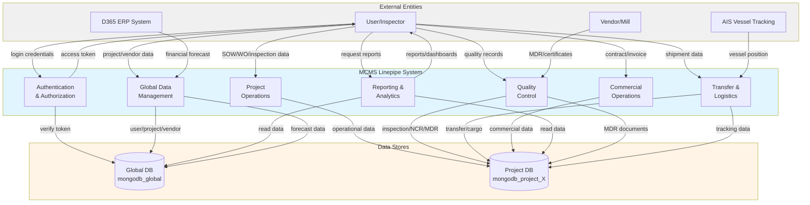
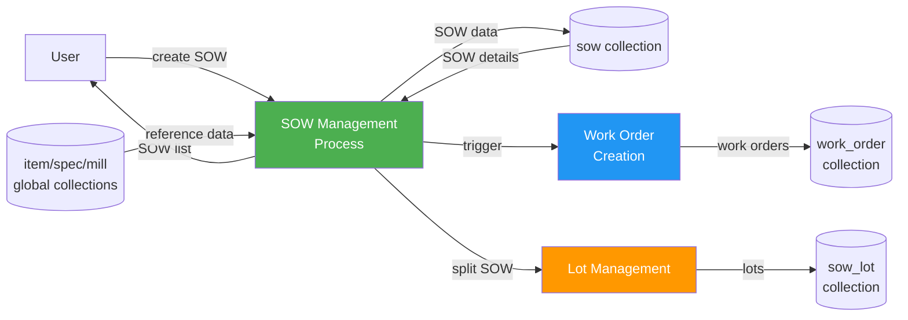
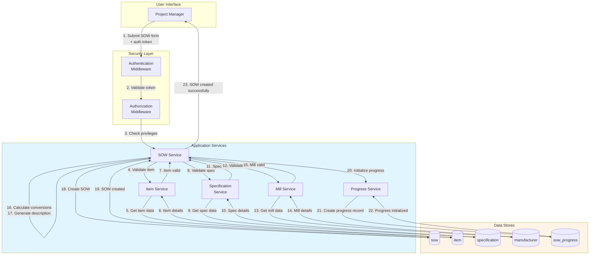
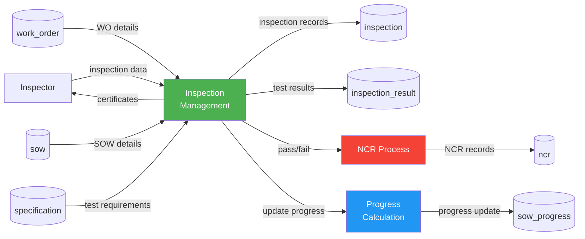
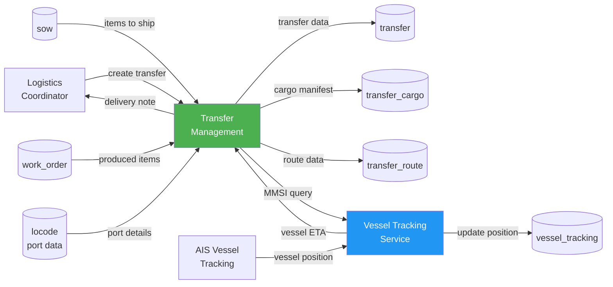
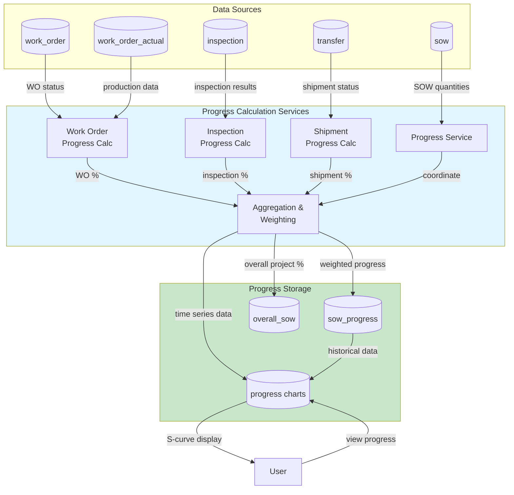
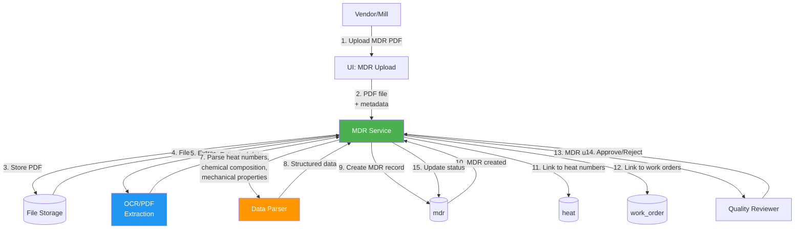
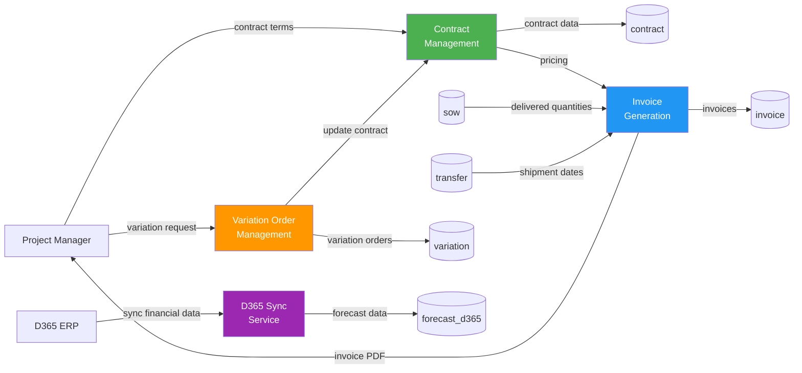
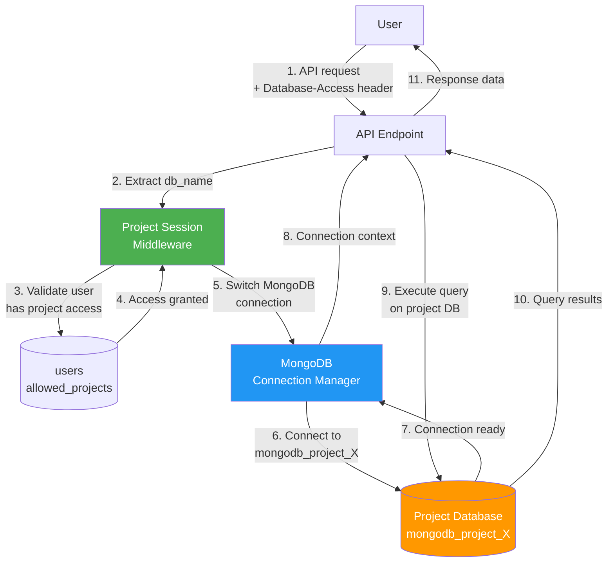

# 7. Data Flow Diagrams

This section illustrates the flow of data through the MCMS Linepipe system using hierarchical Data Flow Diagrams (DFD). Level 0 diagrams provide high-level overviews, while Level 1 diagrams show detailed process interactions.

**Diagram Conventions:**
- **External Entities**: Users, vendors, external systems (rectangles)
- **Processes**: System functions and business logic (rounded rectangles)
- **Data Stores**: Database collections (cylinders/parallel lines)
- **Data Flows**: Movement of data between components (arrows)

---

## 7.1 System Overview - Data Flow Diagram Level 0



*Figure 1: MCMS Linepipe System - Level 0 Data Flow Diagram*

---

## 7.2 SOW Management - Data Flow Diagram Level 0



*Figure 2: SOW Management - Level 0 DFD*

---

## 7.3 SOW Management - Data Flow Diagram Level 1



*Figure 3: SOW Creation - Level 1 DFD*

---

## 7.4 Inspection Management - Data Flow Diagram Level 0



*Figure 4: Inspection Management - Level 0 DFD*

---

## 7.5 Transfer & Logistics - Data Flow Diagram Level 0



*Figure 5: Transfer & Logistics - Level 0 DFD*

---

## 7.6 Progress Tracking - Data Flow Diagram Level 1



*Figure 6: Progress Tracking - Level 1 DFD*

---

## 7.7 MDR Management - Data Flow Diagram Level 1



*Figure 7: MDR Upload & Processing - Level 1 DFD*

---

## 7.8 Commercial Operations - Data Flow Diagram Level 0



*Figure 8: Commercial Operations - Level 0 DFD*

---

## 7.9 Authentication & Authorization Flow

```mermaid
graph TB
    USER[User] -->|1. Email + Password| LOGIN[Login API]

    LOGIN -->|2. Validate credentials| USER_DB[(users)]
    USER_DB -->|3. User found| LOGIN

    LOGIN -->|4. Check password hash| BCRYPT[Bcrypt Verify]
    BCRYPT -->|5. Password valid| LOGIN

    LOGIN -->|6. Generate tokens| PASSPORT[Laravel Passport]
    PASSPORT -->|7. Create access token| TOKEN_DB[(oauth_access_tokens)]
    PASSPORT -->|8. Create refresh token| REFRESH_DB[(oauth_refresh_tokens)]

    TOKEN_DB -->|9. Access token| PASSPORT
    PASSPORT -->|10. JWT tokens| LOGIN
    LOGIN -->|11. Auth response<br/>{access_token, refresh_token}| USER

    USER -->|12. API request<br/>+ Bearer token| API[Protected API]
    API -->|13. Verify token| PASSPORT
    PASSPORT -->|14. Query token| TOKEN_DB
    TOKEN_DB -->|15. Token valid + user_id| PASSPORT

    PASSPORT -->|16. Load user| USER_DB
    USER_DB -->|17. User data + role| PASSPORT

    PASSPORT -->|18. Check privilege| PRIV[Privilege<br/>Middleware]
    PRIV -->|19. Authorized| API
    API -->|20. Response data| USER

    style LOGIN fill:#4CAF50,color:#fff
    style PASSPORT fill:#2196F3,color:#fff
    style PRIV fill:#FF9800,color:#fff
```

*Figure 9: Authentication & Authorization - Level 1 DFD*

---

## 7.10 Multi-Tenancy Database Routing



*Figure 10: Multi-Tenancy Database Routing - Level 1 DFD*

---

## Notes

- All data flows include implicit error handling and validation not shown in diagrams for clarity
- Database transactions ensure ACID compliance for critical operations (SOW creation, invoice generation, etc.)
- Caching layers (Redis/Laravel Cache) are used for frequently accessed reference data (not shown)
- File uploads go through queue processing for large files (MDR PDFs, inspection photos)
- Progress calculations run on-demand and are cached with invalidation triggers
