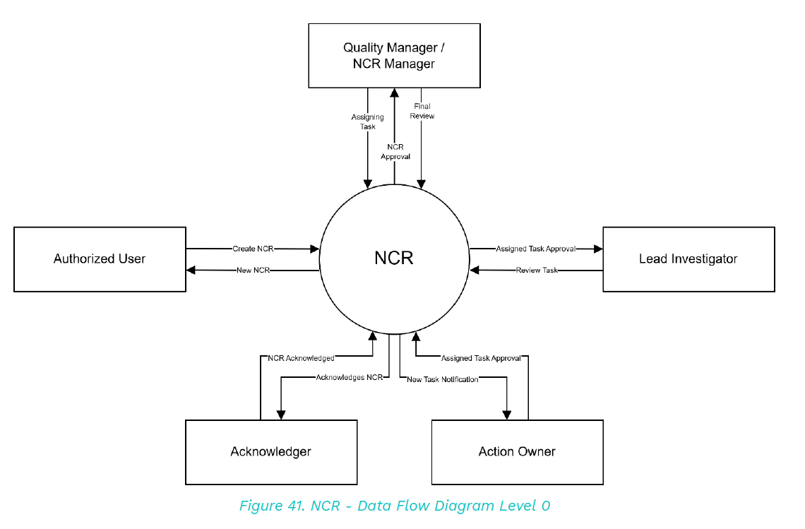
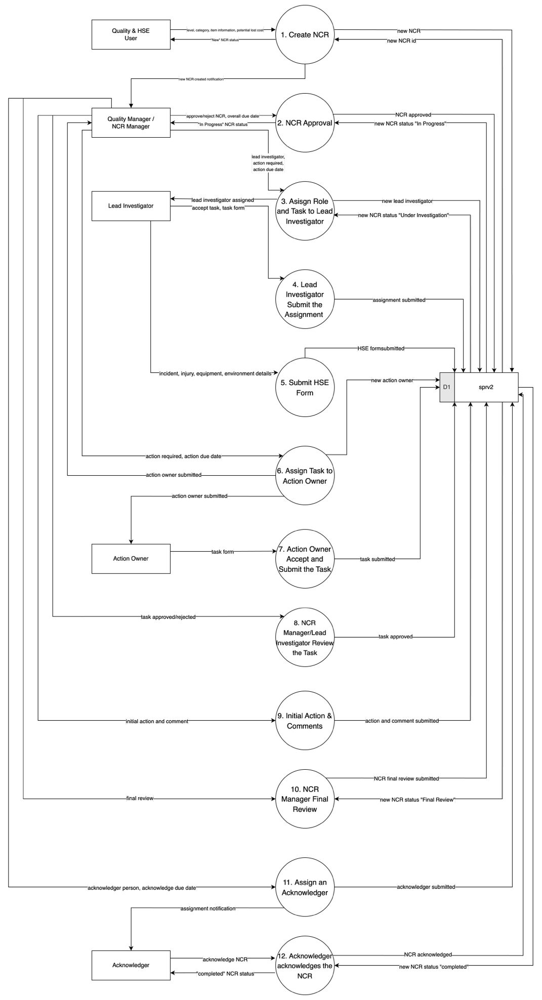

7.2 Quality & HSE
7.2.1 SPR / NCR
7.2.1.1 NCR - Data Flow Diagram Level 0
This image represents a Level 0 Data Flow Diagram (DFD) for the main process of NCR in Tubestream. It outlines the key interactions between users and the system, showing how data flows between entities and the NCR process.

This diagram illustrates the Non-Conformance Report (NCR) process, showing how data flows between key roles and the NCR system. The process begins when the Quality & HSE User creates a new NCR. This report is then submitted to the Quality Manager / NCR Manager, who is responsible for reviewing the report, assigning the lead investigator, and approving the NCR.
The Lead Investigator is tasked with reviewing the NCR and providing their approval for task assignment. Once approved, the Action Owner is assigned specific tasks to resolve the non-conformance, and progress is tracked through task verification.
The Acknowledger also plays a role by confirming that the NCR has been acknowledged in the system.
This NCR process ensures systematic handling of non-conformities through defined responsibilities and approvals. It supports traceability and accountability by involving relevant roles in every step—from initial report creation to task completion and acknowledgment—thus maintaining quality standards and regulatory compliance.
7.2.1.2 NCR - Data Flow Diagram Level 1
This Data Flow Diagram (DFD) level 1 visualizes the NCR process in Tubestream, depicting the flow of data between users, processes, and databases. It offers a more detailed view compared to the Level 0 diagram above. The image below presents the DFD for Tubestream's NCR process.

The key components are explained on the table below.
Table 80. NCR - Data Flow Diagram level 1 key components No. User Input Process Output
1
Quality & HSE User
Create NCR
•
Dept, category, item info, potential lost cost
New NCR, NCR ID in sprv2 (D1)
2
Quality Manager / NCR Manager
NCR Approval
NCR submitted
NCR approved, status "In Progress"
3
Lead Investigator
Assign Role and Task to Lead Investigator
Lead investigator, task form
Assignment accepted, status "Under Investigation"
4
Lead Investigator
Submit the Assignment
Completed assignment
Assignment submitted
5
Lead Investigator
Submit HSE Form
Incident, injury, equipment, environment details
HSE form submitted in sprv2 (D1)
6
NCR Manager
Assign Task to Action Owner
Action required, due date
Task assigned
7
Action Owner
Accept and Submit Task
Task form
Task submitted
8
NCR Manager / Lead Investigator
Review Task
Task submitted
Task approved/rejected
9
NCR Manager / Lead Investigator
Initial Action & Comments
Initial action, comment
Action and comment submitted
10
NCR Manager
Final Review
Final review input
Status "Final Review"
11
NCR Manager
Assign an Acknowledger
Acknowledger name, due date
Acknowledger assigned
12
Acknowledger
Acknowledge the NCR
NCR acknowledged
NCR status "Completed" in sprv2 (D1)