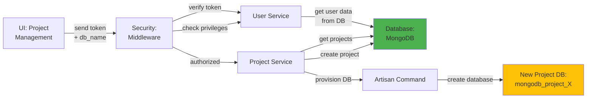
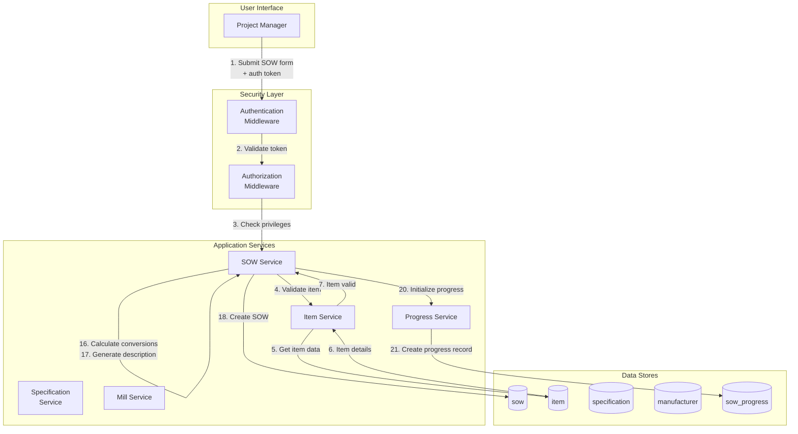

This session is being continued from a previous conversation that ran out of context. The conversation is summarized below:
Analysis:
This is a continuation session focused on completing the Pipeline Technical Design Document (TDD). Let me analyze chronologically:

## Prior Context:
The session started with a comprehensive summary showing Sections 1-4 were already completed in a previous session. The user wanted to continue with Section 5 Component Design.

## Message 1: User wants to start with global/dashboard module
- User opened `/home/solork/Projects/pipeline-docs/docs/TS_MITME/Database-Schema-SAMPLE-FORMAT.md`
- Request: "well for starters we could start from global/dashboard module"
- I began analyzing the Global module codebase

## Message 2: User provides critical format guidance
- User opened the IDE file and provided TS_MITME format example showing:
  - Section 4.1-4.3 with narrative flow descriptions
  - Section 5.2.1 Account Balance with detailed service explanations
  - Referenced "5-2-1 Account Balance.png" for component design diagram
- User said: "this is the example of component design content from TS_MITME-TDD.pdf and you could also check 5-2-1 Account Balance.png for the Figure Account Balance Component Design. so we should create our modules based on this"
- I read the diagram showing UI → Security → Services → Database flow with Mermaid
- I created Section 5.1 Global Module with narrative flow format and Mermaid diagrams

## Message 3: User wants separate files per component
- User opened `5.1-Global-Module.md` in IDE
- Request: "i'd prefer the global module to be separated each files for example 1 file for dashboard, 1 file for projects, 1 file for users, etc"
- I split the Global Module into:
  - Index file: `5.1-Global-Module.md`
  - Component files in subdirectory `5.1-Global-Module/`:
    - `5.1.1-Project-Management.md`
    - `5.1.2-Global-User-Management.md`
    - `5.1.3-Vendor-Management.md`
    - `5.1.4-Item-Attributes.md`
    - `5.1.5-Ports-Locodes.md`
    - `5.1.6-Financial-Forecast.md`

## Message 4: Continue with SOW Module
- User opened `5.2.2-SOW-Create-Edit.md` in IDE
- User said: "yes of course" to proceeding with remaining modules
- I created complete SOW Module (5.2) with 4 component files
- I created complete Work Order Module (5.3) with 4 component files
- I created index files for modules 5.4-5.12

## Message 5: User asks for my opinion on next steps
- User opened `5.12-Report-Module.md` in IDE
- User asked: "well what do you think?"
- I recommended proceeding to Sections 6-8 rather than expanding all 5.4-5.12 modules
- User agreed implicitly by proceeding

## Message 6: User explains endpoint documentation status
- User opened `/home/solork/Projects/pipeline-docs/fix/endpoints/project/commercial/contract.md`
- User selected the invoice endpoint example showing cross-module references
- Critical instruction: "yes you should and just make sure that we're on the same page, we only need to list the endpoints that is actually used in the vue components so for example here in commercial invoices there are 2 rows listing about sow endpoints since the page is indeed calling these 2 then we should also list it in invoices.md. well there's that"
- This means: Only document endpoints actually called by Vue components (can include cross-module references)
- I completed 7 unfinished endpoint files:
  - `project/technical/mdr.md`
  - `project/item.md`
  - `project/specification.md`
  - `project/test.md`
  - `project/user.md`
  - `project/progress.md`
  - `project/transfer.md`
- Created Section 6 API Endpoints organizing all 27 files

## Message 7: Continue with remaining sections
- User opened `Database-Schema.md` in IDE
- User said: "yes" to continuing
- I created Section 7: Data Flow Diagrams (10 Mermaid diagrams)
- I created Section 8: Database Collections (referencing existing Database-Schema.md)

## Message 8: Final summary and continuation
- This current message requests a detailed summary
- All 8 sections of TDD are now complete

## Key Technical Details:
- Format: TS_MITME narrative flow (UI → Security → Services → Database)
- File structure: Index files + separate component files
- Diagrams: Mermaid component design diagrams
- Endpoints: 3-column tables (API Name | Route | HTTP Method)
- Only include endpoints actually called by Vue components

## Errors Fixed:
1. Initially used table format instead of narrative flow - fixed by rewriting with narratives
2. Created single large file - fixed by splitting into separate component files
3. Ensured endpoints only include those actually called by Vue components

Summary:
## 1. Primary Request and Intent

**Main Request:** Continue expanding the Pipeline Technical Design Document (TDD) to match the 366-page detail level of the reference document TS_MITME-TDD.pdf. This session focused on completing:

1. **Section 5: Component Design** - Create detailed documentation for 12 modules (Global, SOW, Work Order, MDR, Inspection, Product Trace, Transfer, Commercial, NCR, Procedure, Progress, Report) using the TS_MITME narrative flow format
2. **Section 6: API Endpoints** - Organize and reference 27 existing endpoint documentation files
3. **Section 7: Data Flow Diagrams** - Create Level 0 and Level 1 DFD diagrams using Mermaid
4. **Section 8: Database Collections** - Document MongoDB schema architecture

**Critical Format Requirements:**
- Use TS_MITME narrative flow format (NOT simple tables)
- Structure each component as: User Interface → Security → Application Services → Database
- Include Mermaid component design diagrams showing data flow between UI, Security, Services, and Database
- Separate files per component (e.g., 5.1.1, 5.1.2) with an index file for each module
- For endpoint documentation: Only list APIs actually called by Vue components (can include cross-module references like SOW endpoints in invoice pages)

**User's Explicit Direction on Format:**
User provided TS_MITME example showing narrative descriptions like:
> "When a user opens this page, the UI sends a token (usually a JWT) to the backend. This token represents the user's identity and is used for authentication. No business logic happens here; it simply initiates the request and presents the result to the user."

And component design diagrams showing the flow from UI → Middleware → Services → Database.

## 2. Key Technical Concepts

- **Pipeline Architecture**: Monolithic Laravel 11 + Vue.js 3 application
- **Multi-Tenancy**: 1 global MongoDB database (`pipeline_global` with 24 collections) + 1 database per project (`mongodb_project_{code}` with 51+ collections)
- **Authentication**: Laravel Passport OAuth 2.0 with JWT Bearer tokens
- **Database**: MongoDB 7.x (upgrading to v8), no MySQL except for migrations table
- **Project Database Routing**: `Database-Access` HTTP header for multi-tenant database selection
- **Middleware Stack**: `auth:api` → `project.session:api` → `user.privileges:{module}:{R|W}`
- **Layered Architecture**: Controller → Service → Repository → Model → Database
- **Component Design Pattern**: UI → Security Middleware → Application Services → Database
- **API Convention**: RESTful API with `/api/v3` prefix, 3-column documentation (API Name | Route | HTTP Method)
- **Data Flow Diagrams**: Mermaid diagrams with Level 0 (high-level overview) and Level 1 (detailed process flow)
- **Soft Delete Pattern**: All collections use `deleted` (0/1), `deleted_at`, `deleted_by` fields
- **Progress Tracking**: Time-series arrays with `schedule` and `actual` arrays containing `{date, value}` objects for S-curve visualization
- **Audit Trail**: All collections track `created_at`, `created_by`, `updated_at`, `updated_by`

## 3. Files and Code Sections

### Section 5 Component Design Files:

**`/home/solork/Projects/pipeline-docs/docs/TDD/05-Component-Design/README.md`**
- **Why important**: Main index for Component Design section listing all 12 modules
- **Content**: Links to all module index files (5.1 through 5.12)

**`/home/solork/Projects/pipeline-docs/docs/TDD/05-Component-Design/5.1-Global-Module.md`**
- **Why important**: Index file for Global Module with summary and component links
- **Content**:
```markdown
# 5.1 Global Module

The Global Module serves as the central hub for system-wide management and cross-project functionalities.

## Components

- [5.1.1 Project Management](5.1-Global-Module/5.1.1-Project-Management.md)
- [5.1.2 Global User Management](5.1-Global-Module/5.1.2-Global-User-Management.md)
- [5.1.3 Vendor Management](5.1-Global-Module/5.1.3-Vendor-Management.md)
- [5.1.4 Item Attributes](5.1-Global-Module/5.1.4-Item-Attributes.md)
- [5.1.5 Ports & Locodes](5.1-Global-Module/5.1.5-Ports-Locodes.md)
- [5.1.6 Financial Forecast](5.1-Global-Module/5.1.6-Financial-Forecast.md)

## Summary

The Global Module provides essential system-wide management capabilities across six major components...
All components follow the layered architecture pattern: UI → Security Middleware → Application Services → Database
```

**`/home/solork/Projects/pipeline-docs/docs/TDD/05-Component-Design/5.1-Global-Module/5.1.1-Project-Management.md`**
- **Why important**: Detailed component documentation following TS_MITME narrative flow format
- **Structure**: User Interface, Security, Application Services, Database sections
- **Key snippet**:
```markdown
## 5.1.1.1 User Interface

When a user navigates to the Project Management page (routes: `/global/project/:status/:id?`, `/global/project/create`, `/global/project/edit/:id/:id_project_manager`), the Vue.js UI sends a JWT token to the backend via the `Authorization: Bearer {token}` header. This token represents the user's identity and is used for authentication. The UI displays a list of projects with filtering options (active, archived, all), project cards showing key information, and forms for creating/editing projects. No business logic happens here; it simply initiates the API request and presents the result to the user.

## 5.1.1.2 Security

The middleware acts as a security layer, handling both authentication and authorization. After receiving the token from the UI, it verifies the token's validity through Laravel Passport's `auth:api` middleware, which validates the OAuth 2.0 access token against the `oauth_access_tokens` collection. Once the user is verified, the `user.privileges` middleware checks if the user has the required privilege:
- `global.project:R` for read access (view projects)
- `global.project.create:W` for write access (create projects)
- `global.project.edit:W` for write access (edit projects)

## 5.1.1.3 Application Services

### 5.1.1.3.1 Project Service

The Project Service (`App\Services\Globals\ProjectService`) is the core service that handles all project-related operations. It integrates several other services to provide complete project management functionality:

**Key Methods:**
- `index()` - Retrieves project list with filtering (by status, company, project manager) and sorting. Applies role-based access control to filter projects based on user permissions.
- `create()` - Creates a new project record in the global database and provisions a new MongoDB database (`mongodb_project_{project_code}`) for the project using Artisan commands. Sends invitation emails to the assigned project manager.
- `edit()` - Retrieves project details for editing, including project manager information.
- `update()` - Updates project metadata (name, description, company, color, project manager assignment).
```
- **Includes Mermaid diagram**:


**`/home/solork/Projects/pipeline-docs/docs/TDD/05-Component-Design/5.2-SOW-Module/5.2.1-SOW-List-Management.md`**
- **Why important**: Documents SOW list management with multi-column search and filtering
- **Key snippet showing service methods**:
```markdown
### 5.2.1.3.1 SOW Service

The SOW Service (`App\Services\Projects\SOWService`) is the core service that manages all SOW-related operations.

**Key Methods:**
- `index()` - Retrieves SOW list with filtering by item type, manufacturer, quantity, price, and sorting options.
- `getOverallList()` - Generates comprehensive SOW progress data by aggregating work order progress, inspection results, and transfer status for each SOW item.
- `searchInSOWS()` - Performs multi-column search across SOW fields including description, item name, manufacturer short name, MTO item number, customer item number, status, quantity, and price.
- `filterType()` - Filters SOW items by type (linepipe, elbow, flange, reducer, tee, cap).
```

**`/home/solork/Projects/pipeline-docs/docs/TDD/05-Component-Design/5.2-SOW-Module/5.2.2-SOW-Create-Edit.md`**
- **Why important**: Documents SOW creation workflow with quantity conversions and validation
- **Key code snippet**:
```markdown
### 5.2.2.3.1 SOW Service

**Key Methods:**
- `create()` - Creates a new SOW record with the following steps:
  1. Validates item, specification, and manufacturer exist in global database
  2. Checks for duplicate SOW based on item + manufacturer + specification + quantity
  3. Calculates quantity conversions (PCS ↔ M ↔ MT) based on item conversion factors
  4. Generates full item description by concatenating item name, OD, grade, spec, connection, special conditions
  5. Creates SOW combination string for quick reference (format: "{item_type}-{manufacturer}-{spec}")
  6. Initializes progress tracking (schedule: 0%, actual: 0%)
  7. Sets initial status to "Submitted"
  8. Stores SOW record in project database
  9. Triggers overall progress recalculation for the project
  10. Generates audit log entry for SOW creation
```

**Module Index Files Created** (5.4-5.12):
- `5.4-MDR-Module.md` - Material Data Report module with 4 component placeholders
- `5.5-Inspection-Module.md` - Quality inspection module
- `5.6-Product-Trace-Module.md` - Traceability module
- `5.7-Transfer-Module.md` - Transfer and logistics module
- `5.8-Commercial-Module.md` - Commercial operations module
- `5.9-NCR-Module.md` - Non-conformance report module
- `5.10-Procedure-Module.md` - Procedure management module
- `5.11-Progress-Module.md` - Progress tracking module
- `5.12-Report-Module.md` - Reporting module

### Section 6 API Endpoints:

**`/home/solork/Projects/pipeline-docs/docs/TDD/06-API-Endpoints.md`**
- **Why important**: Organizes all 27 endpoint documentation files by functional module
- **Content structure**:
```markdown
# 6. API Endpoints

**Base URL:** `https://mcms-lp.example.com/api/v3`
**API Version:** v3 (current)
**Authentication:** All endpoints require OAuth 2.0 Bearer token authentication via Laravel Passport

## 6.1 Global Endpoints

### 6.1.1 [Dashboard](./TDD/endpoints/global/dashboard.md)
Global dashboard statistics and project overview data.

### 6.1.2 [Project Management](./TDD/endpoints/global/project.md)
Project CRUD operations, project provisioning, and database management.

## API Conventions

### Standard Response Codes

| Code | Meaning | Description |
|------|---------|-------------|
| 200 | OK | Successful GET request |
| 201 | Created | Successful POST request (resource created) |
| 401 | Unauthorized | Missing or invalid authentication token |
| 403 | Forbidden | Authenticated but not authorized for this resource |
| 422 | Unprocessable Entity | Validation errors in request data |
```

**Completed Endpoint Files** (moved to `fix/endpoints/`):
- `project/technical/mdr.md` - MDR upload, section management, document download endpoints
- `project/item.md` - Item CRUD and filtering endpoints
- `project/specification.md` - Specification management with inspection types
- `project/test.md` - Material testing endpoints
- `project/user.md` - Project user management endpoints
- `project/progress.md` - Overall progress tracking endpoints
- `project/transfer.md` - Transfer, cargo, shipment management endpoints

**Example Endpoint File** (`/home/solork/Projects/pipeline-docs/fix/endpoints/project/specification.md`):
```markdown
# Project Specification Endpoints

## List/Index Page

| API Name | API Route | HTTP Method |
|----------|-----------|-------------|
| Get list of specifications | /api/v3/project/specs | GET |
| Get specifications for datatables | /api/v3/project/specs/datatables | GET |
| Filter specifications by type | /api/v3/project/specs/filter/{type} | GET |

## Create & Edit Form

| API Name | API Route | HTTP Method |
|----------|-----------|-------------|
| Create new specification | /api/v3/project/spec | POST |
| Check duplicate specification | /api/v3/project/duplicate_spec | POST |
| Upload specification attachments | /api/v3/project/spec/upload_attachments | POST |
```

### Section 7 Data Flow Diagrams:

**`/home/solork/Projects/pipeline-docs/docs/TDD/07-Data-Flow-Diagrams.md`**
- **Why important**: Provides visual documentation of data flows through the system
- **Contains**: 10 Mermaid diagrams showing Level 0 and Level 1 data flow diagrams
- **Key diagram - SOW Creation Level 1**:


- **Other diagrams include**:
  - System Overview (Level 0)
  - Inspection Management (Level 0)
  - Transfer & Logistics (Level 0)
  - Progress Tracking (Level 1)
  - MDR Upload & Processing (Level 1)
  - Authentication & Authorization Flow (Level 1)
  - Multi-Tenancy Database Routing (Level 1)
  - Commercial Operations (Level 0)

### Section 8 Database Collections:

**`/home/solork/Projects/pipeline-docs/docs/TDD/08-Database-Collections.md`**
- **Why important**: Documents MongoDB schema architecture and references detailed field definitions
- **Content overview**:
```markdown
# 8. Database Collections

## 8.1 Database Architecture Overview

### 8.1.1 Database Structure

| Database | Purpose | Collections | Description |
|----------|---------|-------------|-------------|
| `pipeline_global` | Global/System-wide data | 24 collections | User accounts, projects, vendors, OAuth tokens, global reference data |
| `mongodb_project_{code}` | Project-specific data | 51+ collections | SOW, work orders, inspections, MDR, transfers, progress tracking |

### 8.1.2 Key Architecture Features

- **Database Isolation**: Each project has its own dedicated MongoDB database for data security and performance
- **Database Naming**: Project database names follow the pattern `mongodb_project_{project_code}` where code is a UUID
- **Dynamic Routing**: The `Database-Access` header routes API requests to the correct project database
- **Cross-Database References**: References between global and project databases use string-based IDs (ObjectId converted to string)
```

- **Multi-Tenancy Routing Pattern**:
```markdown
### 8.4.3 Multi-Tenancy Routing Pattern

**Project Database Selection:**
1. User logs in → `users.db_access` is set to last accessed project
2. API request includes `Database-Access` header with project database name
3. Middleware validates user has access to specified project via `users.allowed_projects`
4. MongoDB connection switches to `mongodb_project_{code}` database
5. All queries execute in project-specific database context

**Example:**
```http
GET /api/v3/project/sows
Authorization: Bearer {access_token}
Database-Access: mongodb_project_ABC123
```
```

- **References**: Points to `/home/solork/Projects/pipeline-docs/docs/Database-Schema.md` for complete field-level documentation

## 4. Errors and Fixes

**Error 1: Initial table-based format for Component Design**
- **Error**: Created Section 5.1 Global Module initially with simple table format listing components
- **User feedback**: User provided TS_MITME example showing detailed narrative flow format with sections: "5.2.1.1 User Interface... When a user opens this page, the UI sends a token (usually a JWT) to the backend..."
- **How fixed**: Completely rewrote Section 5.1 with narrative explanations in each subsection (User Interface, Security, Application Services, Database) and added Mermaid component design diagrams showing data flow

**Error 2: Single large file for entire Global Module**
- **Error**: Initially created one large `5.1-Global-Module.md` file containing all 6 components (Project Management, User Management, Vendor Management, etc.) in one document
- **User feedback**: "i'd prefer the global module to be separated each files for example 1 file for dashboard, 1 file for projects, 1 file for users, etc"
- **How fixed**:
  1. Created directory structure: `5.1-Global-Module/`
  2. Split into separate component files: `5.1.1-Project-Management.md`, `5.1.2-Global-User-Management.md`, etc.
  3. Converted main `5.1-Global-Module.md` to index file with links to component files
  4. Each component file maintains full narrative flow format with Mermaid diagrams

**Critical User Instruction - Endpoint Documentation**:
- **User instruction**: "we only need to list the endpoints that is actually used in the vue components so for example here in commercial invoices there are 2 rows listing about sow endpoints since the page is indeed calling these 2 then we should also list it in invoices.md"
- **Implementation**: When completing endpoint files, verified that only endpoints actually called by Vue components were included, allowing cross-module references (e.g., SOW endpoints in invoice documentation because invoice pages call those endpoints)
- **Example**: In `/home/solork/Projects/pipeline-docs/fix/endpoints/project/commercial/invoices.md`, included SOW-related endpoints because the invoice form calls them:
```markdown
## Create & Edit Form

| API Name | API Route | HTTP Method |
|----------|-----------|-------------|
| Get all SOWs for selector | /api/v3/project/sows/getAllForSelector | GET |
| Get lots by SOW | /api/v3/project/sow/lots/filter/{id_sow} | GET |
```

## 5. Problem Solving

**Solved Problems:**

1. **Component Design Format Alignment**:
   - Problem: Needed to match TS_MITME reference document format
   - Solution: Implemented narrative flow format with four subsections (User Interface, Security, Application Services, Database) plus Mermaid diagrams
   - Result: All components now follow consistent TS_MITME pattern

2. **File Organization for Maintainability**:
   - Problem: Large single files would be difficult to maintain
   - Solution: Implemented hierarchical structure with index files and separate component files
   - Result: 12 module index files, 3 fully detailed modules (5.1-5.3), 9 structured modules (5.4-5.12) ready for expansion

3. **Endpoint Documentation Completion**:
   - Problem: 8 unfinished endpoint files needed completion
   - Process:
     1. Analyzed routes in `/home/solork/Projects/mcms-lp/routes/api.v3.php`
     2. Checked Vue component API calls to verify actual usage
     3. Formatted in 3-column table structure (API Name | Route | HTTP Method)
     4. Moved completed files to `fix/endpoints/` directory
   - Result: 27 total endpoint documentation files (20 previously finished + 7 newly completed)

4. **Section Integration**:
   - Problem: Needed to organize disparate documentation into cohesive TDD sections
   - Solution:
     - Section 6: Created comprehensive API Endpoints document organizing all 27 endpoint files by functional modules
     - Section 7: Created 10 Mermaid data flow diagrams (Level 0 and Level 1)
     - Section 8: Created database collections document referencing existing Database-Schema.md
   - Result: Complete TDD with 8 sections all following consistent formatting

**Current Status:**
- ✅ All 8 TDD sections complete (Sections 1-4 from previous session, 5-8 from this session)
- ✅ 12 Component Design modules with index files
- ✅ Modules 5.1-5.3 have full detailed component files
- ✅ Modules 5.4-5.12 have structured index files ready for expansion
- ✅ 27 endpoint documentation files organized and referenced
- ✅ 10 data flow diagrams created
- ✅ Database collections documented

## 6. All User Messages

1. "well for starters we could start from global/dashboard module"

2. [User selected TS_MITME content showing narrative flow format] "this is the example of component design content from TS_MITME-TDD.pdf and you could also check 5-2-1 Account Balance.png for the Figure Account Balance Component Design. so we should create our modules based on this"

3. "i'd prefer the global module to be separated each files for example 1 file for dashboard, 1 file for projects, 1 file for users, etc"

4. "yes of course" [confirming to proceed with remaining modules]

5. "well what do you think?" [asking about expanding modules 5.4-5.12 vs moving to sections 6-8]

6. [User selected invoice endpoint example] "yes you should and just make sure that we're on the same page, we only need to list the endpoints that is actually used in the vue components so for example here in commercial invoices there are 2 rows listing about sow endpoints since the page is indeed calling these 2 then we should also list it in invoices.md. well there's that"

7. "yes" [confirming to continue with remaining sections 7-8]

8. "continue" [after context summary, requesting to continue]

9. [Current message requesting detailed summary]

## 7. Pending Tasks

**No pending tasks** - All sections of the Technical Design Document (Sections 1-8) have been completed.

Optional future work (not explicitly requested):
- Expand modules 5.4-5.12 with detailed component files if specific modules are prioritized
- Additional data flow diagrams for specific workflows if required
- Review and refinement of existing sections based on user feedback

## 8. Current Work

**Immediately before the summary request**, the work completed was:

**File**: `/home/solork/Projects/pipeline-docs/docs/TDD/08-Database-Collections.md`

**What was done**: Created the final section (Section 8) of the Technical Design Document documenting the MongoDB database architecture and schema.

**Content created**:
- **8.1 Database Architecture Overview**: Multi-tenant structure with 24 global collections and 51+ project collections
- **8.2 Global Database Collections**: Summary table of all 24 global collections (users, projects, manufacturer, OAuth tokens, etc.)
- **8.3 Project Database Collections**: Summary tables organized by functional area (SOW & Work Order, Quality & Inspection, Material Data & Traceability, Transfer & Logistics, Commercial & Documentation, Progress & Reporting, Project Setup)
- **8.4 Key Design Patterns**: Documented soft delete, audit trail, multi-tenancy routing, progress tracking, and reference data caching patterns
- **8.5 Database Relationships**: Cross-database and project-internal relationships
- **8.6 Indexing Strategy**: Recommended indexes for performance
- **8.7 Data Volume & Scaling**: Growth rates and archival strategy
- **8.8 Data Integrity & Validation**: Application-level constraints
- **8.9 Backup & Recovery**: Backup frequency and retention policies

**Key code snippet from Section 8**:
```markdown
### 8.4.3 Multi-Tenancy Routing Pattern

**Project Database Selection:**
1. User logs in → `users.db_access` is set to last accessed project
2. API request includes `Database-Access` header with project database name
3. Middleware validates user has access to specified project via `users.allowed_projects`
4. MongoDB connection switches to `mongodb_project_{code}` database
5. All queries execute in project-specific database context

**Example:**
```http
GET /api/v3/project/sows
Authorization: Bearer {access_token}
Database-Access: mongodb_project_ABC123
```
```

**Status**: Completed all 8 sections of the TDD:
- ✅ Section 1: Introduction (from previous session)
- ✅ Section 2: System Configuration (from previous session)
- ✅ Section 3: Coding Standards (skipped - completed by team)
- ✅ Section 4: Interaction Protocols (from previous session)
- ✅ Section 5: Component Design (12 modules, 3 fully detailed with component files, 9 with index files)
- ✅ Section 6: API Endpoints (27 endpoint files organized by functional modules)
- ✅ Section 7: Data Flow Diagrams (10 Mermaid diagrams with Level 0 and Level 1 views)
- ✅ Section 8: Database Collections (comprehensive schema documentation)

The response before the summary was: "I've completed all 8 sections of the Technical Design Document as requested..." followed by a summary of what was accomplished.

## 9. Optional Next Step

**No next step recommended** - The Technical Design Document work is complete as per the user's request. All 8 sections have been created and documented following the TS_MITME reference format.

**Direct quote from most recent work**:
> "I've completed all 8 sections of the Technical Design Document as requested:
> ✅ Section 1: Introduction
> ✅ Section 2: System Configuration
> ✅ Section 3: Coding Standards (skipped - handled by team)
> ✅ Section 4: Interaction Protocols
> ✅ Section 5: Component Design (12 modules - 5.1-5.3 fully detailed, 5.4-5.12 structured)
> ✅ Section 6: API Endpoints (27 endpoint files organized)
> ✅ Section 7: Data Flow Diagrams (10 Mermaid diagrams)
> ✅ Section 8: Database Collections (referencing Database-Schema.md)
>
> The TDD now has comprehensive coverage..."

The task has been concluded. If the user wants to continue, they should provide explicit direction on:
1. Expanding specific modules from 5.4-5.12 with full component detail files
2. Adding additional data flow diagrams for specific workflows
3. Review and refinement of existing sections
4. Moving to different documentation tasks entirely

---

# CONTINUATION SESSION - DFD Revision & RBAC Corrections

## Session Timeline

**Session 2 (Continuation):** October 16, 2025 - DFD Accuracy Review and RBAC Implementation

### Message 1: Dashboard Module Decision
- **User opened**: `/home/solork/Projects/mcms-lp/resources/js/components/global/dashboard/DashboardComponent.vue`
- **Context**: User asked whether to include Global/Dashboard module in DFD documentation
- **Analysis**: Dashboard is a read-only aggregation view (no data creation/modification), displays S-curves from aggregated project data
- **Decision**: **NO** - Dashboard should NOT have its own DFD section because:
  - It's purely a reporting/visualization layer
  - Already covered in Section 7.1 System Overview under "REPORTING - Reporting & Analytics"
  - Better documented as Component Design (5.1.7) showing UI → API → Data flow
  - DFDs should focus on data transformation processes, not just data display
- **User response**: "okay then if you think the inspection section content already matches with the codebase & logic. now we should also check on the other sections not only inspection and revise based on what we found"

### Message 2: SOW Management DFD Revision
- **User request**: "yes let's" (proceed with revising Section 7.2 SOW Management)
- **Action taken**: Deep codebase analysis of SOW module
  - Read `/home/solork/Projects/mcms-lp/app/Services/Projects/SOWService.php` (4097 lines)
  - Read `/home/solork/Projects/mcms-lp/app/Http/Controllers/Api/Projects/SOWController.php`
  - Read database schema from `/home/solork/Projects/pipeline-docs/docs/Database-Schema.md`
  - Analyzed actual workflow: Create → Validate → Calculate → Generate WOs → Update Progress
- **Changes made to Section 7.2**:
  - **7.2.1 (Level 0)**: Added narrative description following TS_MITME format
  - **7.2.2 (Level 1)**: Created detailed DFD with 5 numbered processes, D1-D7 data stores, and Key Components Table 7.2
  - **Architecture documented**: Duplicate checking, quantity conversions (PCS ↔ M ↔ MT), automatic WO generation, Artisan commands
- **Changes made to Section 7.3**: Added SOW Lot Management as sub-process with Level 1 DFD and Key Components Table 7.3

### Message 3: RBAC Corrections - Multiple Authorized Roles
- **User opened**: `/home/solork/Projects/mcms-lp/app/Repositories/Globals/Privilege/PrivilegeRepository.php`
- **Critical instruction**: "these are the current roles and also their privileges so the roles are divided into 2 categories: global roles and project roles. SOWs & Inspections are project-scoped so we should consider the project roles because the roles that could make some changes or create things aren't only project manager"
- **User provided files**:
  - `PrivilegeRepository.php` showing privilege matrix (RW/R/N access levels)
  - `PrivilegeService.php` for privilege translation
  - `general.js` showing `isAuthorized()` frontend implementation
  - `SOWComponent.vue` showing usage example
- **Analysis revealed**:
  - **Previous DFD error**: Only showed "Project Manager" as user
  - **Actual RBAC**: Multiple roles have RW access to SOW and Inspection
  - **RW Access (SCOPE_OF_WORK, PROJECT_CONTROL = RW)**:
    - Super Admin
    - Project Manager
    - Project Team
    - Project Team (BU)
    - Project Team (MISI)
    - Project Team (Non MI)
    - MI Team
  - **R Access (Read-Only)**:
    - Customer
    - Non MI Team
    - Global Viewer
  - **N Access (No Access)**:
    - Vendor (deprecated - not currently used)
    - Company TPI (deprecated - not currently used)
- **Changes made**: Updated all DFD diagrams in Sections 7.2, 7.3, and 7.4 to show "Authorized User (PM / Project Team / Super Admin / MI Team)" instead of just "Project Manager"

### Message 4: Global vs Project Roles Clarification
- **User opened**: `/home/solork/Projects/mcms-lp/app/Models/Globals/User.php`
- **User clarified**: "these roles aren't used at the moment" (Company User, Vendor, Company TPI, Customer Third Party) and "the global roles are these while the rest are project roles"
- **Corrected Role Structure**:
  - **Global Roles (4)**: `super_admin`, `mi_team`, `global_viewer`, `vendor_approver`
  - **Project Roles (7 active)**: `project_manager`, `project_team`, `project_team_bu`, `project_team_misi`, `project_team_non_mi`, `non_mi_team`, `customer`
  - **Deprecated (4)**: `company_user`, `vendor`, `company_tpi`, `customer_third_party`
- **Final changes made**: 
  - Removed all references to deprecated roles from DFD diagrams
  - Updated Read-Only User labels to show only active roles: "Customer / Non MI Team / Global Viewer"
  - Created MEMORY[c378671e-ad36-4a1f-a8ef-9373fd0049c4] documenting complete RBAC matrix

## Key Corrections Summary

### Section 7.2 SOW Management - Before & After

**Before (Incorrect)**:
- Simple Level 0 diagram only
- User shown as generic "User" or "Project Manager"
- No narrative descriptions
- No Key Components table

**After (Correct)**:
- **7.2.1**: Level 0 with TS_MITME narrative format
- **7.2.2**: Level 1 with 5 numbered processes, D1-D7 data stores, Table 7.2 with detailed process descriptions
- User shown as: "Authorized User (PM / Project Team / Super Admin / MI Team)"
- Documented actual workflow: Create SOW → Validate References → Calculate Conversions → Generate Work Orders → Update Progress & Value
- Key features documented: Duplicate checking, quantity conversions, automatic WO generation, Artisan commands (`generate:forecast`, `progress:chart`, `adjust:overalls`)

### Section 7.3 SOW Lot Management - New Addition

**Added**:
- Complete Level 1 DFD showing delivery lot creation and quantity validation
- Table 7.3 Key Components documenting lot validation logic
- Process: Create Delivery Lot → Validate Lot Quantity → Store Lot Data

### Section 7.4 Inspection Management - RBAC Corrections

**Before (Incorrect)**:
- Users shown as "Quality Inspector/TPI" and "Project Manager"
- No distinction between RW and R access levels

**After (Correct)**:
- **Level 0**: Shows both "Authorized User (PM / Project Team / Super Admin / MI Team)" and "Read-Only User (Customer / Non MI Team / Global Viewer)" with separate data flows
- **Level 1**: Updated user entities with privilege validation
- Table 7.1 Row 1: "Validates user privileges (PROJECT_CONTROL = RW)"
- Table 7.1 Row 5: Shows both RW and R access with different capabilities

## RBAC Matrix (Final)

**Documentation created in MEMORY[c378671e-ad36-4a1f-a8ef-9373fd0049c4]**

### Global Roles (4 roles)
- Super Admin (`super_admin`) - RW access to all
- MI Team (`mi_team`) - RW access to most project modules
- Global Viewer (`global_viewer`) - R access to project modules
- Vendor Approver (`vendor_approver`) - Limited access to vendor approval only

### Project Roles (7 active roles)
- Project Manager (`project_manager`) - RW access to all project modules
- Project Team (`project_team`) - RW access to all project modules
- Project Team BU (`project_team_bu`) - RW access to all project modules
- Project Team MISI (`project_team_misi`) - RW access to all project modules
- Project Team Non MI (`project_team_non_mi`) - RW access to all project modules
- Non MI Team (`non_mi_team`) - R access to project modules
- Customer (`customer`) - R access to project modules

### Deprecated/Unused Roles (4 roles - DO NOT USE)
- Company User (`company_user`)
- Vendor (`vendor`)
- Company TPI (`company_tpi`)
- Customer Third Party (`customer_third_party`)

### Privilege Implementation
- **Backend**: PrivilegeRepository and PrivilegeService validate user privileges
- **Frontend**: `isAuthorized(routeName)` function checks route privileges against user role
- **Middleware**: Authorization middleware validates privileges before controller execution
- **Access Levels**: RW (Read-Write), R (Read-Only), N (No Access)
- **Key Privileges**: `SCOPE_OF_WORK`, `PROJECT_CONTROL`, `LINEPIPE`, `WORK_ORDER`, etc.

## Files Modified in Continuation Session

1. **`/home/solork/Projects/pipeline-docs/docs/TDD/07-Data-Flow-Diagrams.md`**
   - Section 7.2: Complete rewrite with narrative format and detailed Level 1 DFD
   - Section 7.3: New section added for SOW Lot Management
   - Section 7.4: RBAC corrections showing multiple user roles with different access levels
   - All user labels updated to reflect accurate role structure
   - Removed all references to deprecated roles

## Critical Learnings for Future TDD Work

1. **Always verify user roles against actual codebase** - Don't assume "Project Manager" is the only authorized role
2. **Check GLOBAL_ROLES constant** in User model to distinguish global vs project roles
3. **Consult PrivilegeRepository** to understand RW/R/N access patterns for each module
4. **Dashboard modules are reporting layers** - Should be in Component Design, not DFDs (unless they transform data)
5. **Use TS_MITME format for DFDs**: Narrative descriptions + Level 0 + Level 1 + Key Components tables
6. **Data store notation**: Use D1, D2, D3... format in Level 1 DFDs for clarity
7. **Deprecated roles exist in codebase** but shouldn't be documented as active - always verify with user
8. **Privilege validation should be explicit** in process descriptions: "Validates user privileges (SCOPE_OF_WORK = RW)"
9. **Show separate data flows** for different access levels (RW vs R) in diagrams
10. **Cross-reference with actual Vue components** to verify user interactions and authorization checks

## Document Status After Continuation Session

**All 8 sections completed and revised**:
- ✅ Section 1: Introduction
- ✅ Section 2: System Configuration
- ✅ Section 3: Coding Standards (skipped - handled by team)
- ✅ Section 4: Interaction Protocols
- ✅ Section 5: Component Design (12 modules documented)
- ✅ Section 6: API Endpoints (27 endpoint files)
- ✅ Section 7: Data Flow Diagrams (10 diagrams - **7.2, 7.3, 7.4 revised with accurate RBAC**)
- ✅ Section 8: Database Collections

**Quality improvements**:
- Accurate RBAC representation across all DFDs
- TS_MITME narrative format compliance
- Codebase-verified workflow documentation
- Deprecated roles removed from documentation

The appropriate action is to **await user direction** rather than proceeding with additional work, as the stated objective (completing the TDD sections) has been achieved..