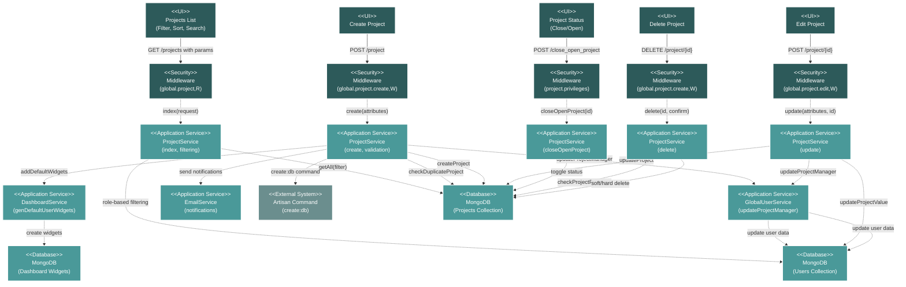

# Global Project Module Flow Diagram

```mermaid
flowchart TD
    %% Top row - UI Components
    UI1["&lt;&lt;UI&gt;&gt;<br/>Projects List<br/>(Filter, Sort, Search)"]
    UI2["&lt;&lt;UI&gt;&gt;<br/>Create Project"]
    UI3["&lt;&lt;UI&gt;&gt;<br/>Edit Project"]
    UI4["&lt;&lt;UI&gt;&gt;<br/>Project Status<br/>(Close/Open)"]
    UI5["&lt;&lt;UI&gt;&gt;<br/>Delete Project"]
    
    %% Second row - Security Middleware & Controllers
    SEC1["&lt;&lt;Security&gt;&gt;<br/>Middleware<br/>(global.project,R)"]
    SEC2["&lt;&lt;Security&gt;&gt;<br/>Middleware<br/>(global.project.create,W)"]
    SEC3["&lt;&lt;Security&gt;&gt;<br/>Middleware<br/>(global.project.edit,W)"]
    SEC4["&lt;&lt;Security&gt;&gt;<br/>Middleware<br/>(project.privileges)"]
    SEC5["&lt;&lt;Security&gt;&gt;<br/>Middleware<br/>(global.project.create,W)"]
    
    %% Third row - Application Services
    AS1["&lt;&lt;Application Service&gt;&gt;<br/>ProjectService<br/>(index, filtering)"]
    AS2["&lt;&lt;Application Service&gt;&gt;<br/>ProjectService<br/>(create, validation)"]
    AS3["&lt;&lt;Application Service&gt;&gt;<br/>ProjectService<br/>(update)"]
    AS4["&lt;&lt;Application Service&gt;&gt;<br/>ProjectService<br/>(closeOpenProject)"]
    AS5["&lt;&lt;Application Service&gt;&gt;<br/>ProjectService<br/>(delete)"]
    
    %% Supporting Services
    USS["&lt;&lt;Application Service&gt;&gt;<br/>GlobalUserService<br/>(updateProjectManager)"]
    DSS["&lt;&lt;Application Service&gt;&gt;<br/>DashboardService<br/>(genDefaultUserWidgets)"]
    ESS["&lt;&lt;Application Service&gt;&gt;<br/>EmailService<br/>(notifications)"]
    
    %% External Systems
    ART["&lt;&lt;External System&gt;&gt;<br/>Artisan Command<br/>(create:db)"]
    
    %% Database
    DB1["&lt;&lt;Database&gt;&gt;<br/>MongoDB<br/>(Projects Collection)"]
    DB2["&lt;&lt;Database&gt;&gt;<br/>MongoDB<br/>(Users Collection)"]
    DB3["&lt;&lt;Database&gt;&gt;<br/>MongoDB<br/>(Dashboard Widgets)"]
    
    %% Flow 1: Projects List (with filtering, sorting, search)
    UI1 -->|"GET /projects with params"| SEC1
    SEC1 -.->|"index(request)"| AS1
    AS1 -.->|"getAll(filter)"| DB1
    AS1 -.->|"role-based filtering"| DB2
    
    %% Flow 2: Create Project (complex workflow)
    UI2 -->|"POST /project"| SEC2
    SEC2 -.->|"create(attributes)"| AS2
    AS2 -.->|"checkDuplicateProject"| DB1
    AS2 -.->|"createProject"| DB1
    AS2 -.->|"updateProjectManager"| USS
    USS -.->|"update user data"| DB2
    AS2 -.->|"addDefaultWidgets"| DSS
    DSS -.->|"create widgets"| DB3
    AS2 -.->|"create:db command"| ART
    AS2 -.->|"send notifications"| ESS
    
    %% Flow 3: Edit Project
    UI3 -->|"POST /project/{id}"| SEC3
    SEC3 -.->|"update(attributes, id)"| AS3
    AS3 -.->|"updateProject"| DB1
    AS3 -.->|"updateProjectValue"| DB2
    AS3 -.->|"updateProjectManager"| USS
    USS -.->|"update user data"| DB2
    
    %% Flow 4: Project Status Change
    UI4 -->|"POST /close_open_project"| SEC4
    SEC4 -.->|"closeOpenProject(id)"| AS4
    AS4 -.->|"toggle status"| DB1
    
    %% Flow 5: Delete Project
    UI5 -->|"DELETE /project/{id}"| SEC5
    SEC5 -.->|"delete(id, confirm)"| AS5
    AS5 -.->|"checkProjectProgress"| DB1
    AS5 -.->|"soft/hard delete"| DB1

    %% Styling
    classDef uiClass fill:#2d5a5a,stroke:#fff,stroke-width:2px,color:#fff
    classDef secClass fill:#2d5a5a,stroke:#fff,stroke-width:2px,color:#fff  
    classDef appClass fill:#4a9999,stroke:#fff,stroke-width:2px,color:#fff
    classDef dbClass fill:#4a9999,stroke:#fff,stroke-width:2px,color:#fff
    classDef extClass fill:#6b8e8e,stroke:#fff,stroke-width:2px,color:#fff
    
    class UI1,UI2,UI3,UI4,UI5 uiClass
    class SEC1,SEC2,SEC3,SEC4,SEC5 secClass
    class AS1,AS2,AS3,AS4,AS5,USS,DSS,ESS appClass
    class DB1,DB2,DB3 dbClass
    class ART extClass
```
