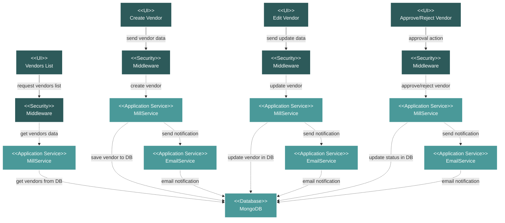

# Global Vendors Module Flow Diagram

```mermaid
flowchart TD
    %% Top row - UI Components (left to right)
    UI1["&lt;&lt;UI&gt;&gt;<br/>Vendors List"]
    UI2["&lt;&lt;UI&gt;&gt;<br/>Create Vendor"]
    UI3["&lt;&lt;UI&gt;&gt;<br/>Edit Vendor"]
    UI4["&lt;&lt;UI&gt;&gt;<br/>Approve/Reject Vendor"]

    %% Second row - Security Middleware
    SEC1["&lt;&lt;Security&gt;&gt;<br/>Middleware"]
    SEC2["&lt;&lt;Security&gt;&gt;<br/>Middleware"]
    SEC3["&lt;&lt;Security&gt;&gt;<br/>Middleware"]
    SEC4["&lt;&lt;Security&gt;&gt;<br/>Middleware"]

    %% Third row - Application Services
    AS1["&lt;&lt;Application Service&gt;&gt;<br/>MillService"]
    AS2["&lt;&lt;Application Service&gt;&gt;<br/>MillService"]
    AS3["&lt;&lt;Application Service&gt;&gt;<br/>MillService"]
    AS4["&lt;&lt;Application Service&gt;&gt;<br/>MillService"]
    AS5["&lt;&lt;Application Service&gt;&gt;<br/>EmailService"]
    AS6["&lt;&lt;Application Service&gt;&gt;<br/>EmailService"]
    AS7["&lt;&lt;Application Service&gt;&gt;<br/>EmailService"]

    %% Bottom - Database
    DB1["&lt;&lt;Database&gt;&gt;<br/>MongoDB"]

    %% Flow 1: Vendors List
    UI1 -->|request vendors list| SEC1
    SEC1 -.->|get vendors data| AS1
    AS1 -.->|get vendors from DB| DB1

    %% Flow 2: Create Vendor
    UI2 -->|send vendor data| SEC2
    SEC2 -.->|create vendor| AS2
    AS2 -.->|save vendor to DB| DB1
    AS2 -.->|send notification| AS5
    AS5 -.->|email notification| DB1

    %% Flow 3: Edit Vendor
    UI3 -->|send update data| SEC3
    SEC3 -.->|update vendor| AS3
    AS3 -.->|update vendor in DB| DB1
    AS3 -.->|send notification| AS6
    AS6 -.->|email notification| DB1

    %% Flow 4: Approve/Reject Vendor
    UI4 -->|approval action| SEC4
    SEC4 -.->|approve/reject vendor| AS4
    AS4 -.->|update status in DB| DB1
    AS4 -.->|send notification| AS7
    AS7 -.->|email notification| DB1

    %% Styling to match original colors
    classDef uiClass fill:#2d5a5a,stroke:#fff,stroke-width:2px,color:#fff
    classDef secClass fill:#2d5a5a,stroke:#fff,stroke-width:2px,color:#fff
    classDef appClass fill:#4a9999,stroke:#fff,stroke-width:2px,color:#fff
    classDef dbClass fill:#4a9999,stroke:#fff,stroke-width:2px,color:#fff

    class UI1,UI2,UI3,UI4 uiClass
    class SEC1,SEC2,SEC3,SEC4 secClass
    class AS1,AS2,AS3,AS4,AS5,AS6,AS7 appClass
    class DB1 dbClass
```
