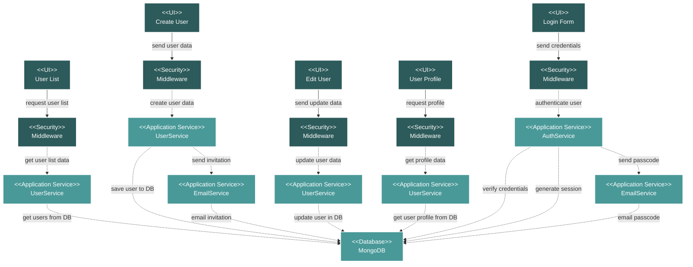

# Global User Module Flow Diagram

```mermaid
flowchart TD
    %% Top row - UI Components (left to right)
    UI1["&lt;&lt;UI&gt;&gt;<br/>User List"]
    UI2["&lt;&lt;UI&gt;&gt;<br/>Create User"]
    UI3["&lt;&lt;UI&gt;&gt;<br/>Edit User"]
    UI4["&lt;&lt;UI&gt;&gt;<br/>User Profile"]
    UI5["&lt;&lt;UI&gt;&gt;<br/>Login Form"]

    %% Second row - Security Middleware
    SEC1["&lt;&lt;Security&gt;&gt;<br/>Middleware"]
    SEC2["&lt;&lt;Security&gt;&gt;<br/>Middleware"]
    SEC3["&lt;&lt;Security&gt;&gt;<br/>Middleware"]
    SEC4["&lt;&lt;Security&gt;&gt;<br/>Middleware"]
    SEC5["&lt;&lt;Security&gt;&gt;<br/>Middleware"]

    %% Third row - Application Services
    AS1["&lt;&lt;Application Service&gt;&gt;<br/>UserService"]
    AS2["&lt;&lt;Application Service&gt;&gt;<br/>UserService"]
    AS3["&lt;&lt;Application Service&gt;&gt;<br/>UserService"]
    AS4["&lt;&lt;Application Service&gt;&gt;<br/>UserService"]
    AS5["&lt;&lt;Application Service&gt;&gt;<br/>AuthService"]
    AS6["&lt;&lt;Application Service&gt;&gt;<br/>EmailService"]
    AS7["&lt;&lt;Application Service&gt;&gt;<br/>EmailService"]

    %% Bottom - Database
    DB1["&lt;&lt;Database&gt;&gt;<br/>MongoDB"]

    %% Flow 1: User List
    UI1 -->|request user list| SEC1
    SEC1 -.->|get user list data| AS1
    AS1 -.->|get users from DB| DB1

    %% Flow 2: Create User
    UI2 -->|send user data| SEC2
    SEC2 -.->|create user data| AS2
    AS2 -.->|save user to DB| DB1
    AS2 -.->|send invitation| AS6
    AS6 -.->|email invitation| DB1

    %% Flow 3: Edit User
    UI3 -->|send update data| SEC3
    SEC3 -.->|update user data| AS3
    AS3 -.->|update user in DB| DB1

    %% Flow 4: User Profile
    UI4 -->|request profile| SEC4
    SEC4 -.->|get profile data| AS4
    AS4 -.->|get user profile from DB| DB1

    %% Flow 5: Authentication
    UI5 -->|send credentials| SEC5
    SEC5 -.->|authenticate user| AS5
    AS5 -.->|verify credentials| DB1
    AS5 -.->|generate session| DB1
    AS5 -.->|send passcode| AS7
    AS7 -.->|email passcode| DB1

    %% Styling to match original colors
    classDef uiClass fill:#2d5a5a,stroke:#fff,stroke-width:2px,color:#fff
    classDef secClass fill:#2d5a5a,stroke:#fff,stroke-width:2px,color:#fff
    classDef appClass fill:#4a9999,stroke:#fff,stroke-width:2px,color:#fff
    classDef dbClass fill:#4a9999,stroke:#fff,stroke-width:2px,color:#fff

    class UI1,UI2,UI3,UI4,UI5 uiClass
    class SEC1,SEC2,SEC3,SEC4,SEC5 secClass
    class AS1,AS2,AS3,AS4,AS5,AS6,AS7 appClass
    class DB1 dbClass
```
