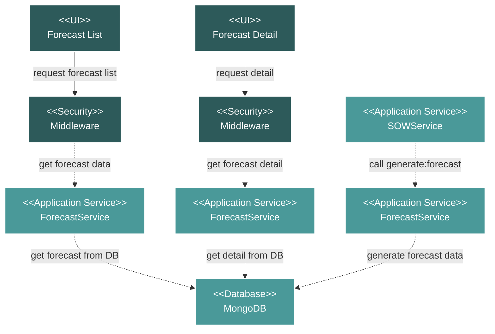

# Global Forecast D365 Module Flow Diagram

```mermaid
flowchart TD
    %% Top row - UI Components (left to right)
    UI1["&lt;&lt;UI&gt;&gt;<br/>Forecast List"]
    UI2["&lt;&lt;UI&gt;&gt;<br/>Forecast Detail"]

    %% Second row - Security Middleware
    SEC1["&lt;&lt;Security&gt;&gt;<br/>Middleware"]
    SEC2["&lt;&lt;Security&gt;&gt;<br/>Middleware"]

    %% Third row - Application Services
    AS1["&lt;&lt;Application Service&gt;&gt;<br/>ForecastService"]
    AS2["&lt;&lt;Application Service&gt;&gt;<br/>ForecastService"]
    AS3["&lt;&lt;Application Service&gt;&gt;<br/>SOWService"]
    AS4["&lt;&lt;Application Service&gt;&gt;<br/>ForecastService"]

    %% Bottom - Database
    DB1["&lt;&lt;Database&gt;&gt;<br/>MongoDB"]

    %% Flow 1: Forecast List
    UI1 -->|request forecast list| SEC1
    SEC1 -.->|get forecast data| AS1
    AS1 -.->|get forecast from DB| DB1

    %% Flow 2: Forecast Detail
    UI2 -->|request detail| SEC2
    SEC2 -.->|get forecast detail| AS2
    AS2 -.->|get detail from DB| DB1

    %% Flow 3: Generate Forecast (triggered by SOW operations)
    AS3 -.->|call generate:forecast| AS4
    AS4 -.->|generate forecast data| DB1

    %% Styling to match original colors
    classDef uiClass fill:#2d5a5a,stroke:#fff,stroke-width:2px,color:#fff
    classDef secClass fill:#2d5a5a,stroke:#fff,stroke-width:2px,color:#fff
    classDef appClass fill:#4a9999,stroke:#fff,stroke-width:2px,color:#fff
    classDef dbClass fill:#4a9999,stroke:#fff,stroke-width:2px,color:#fff

    class UI1,UI2 uiClass
    class SEC1,SEC2 secClass
    class AS1,AS2,AS3,AS4 appClass
    class DB1 dbClass
```
