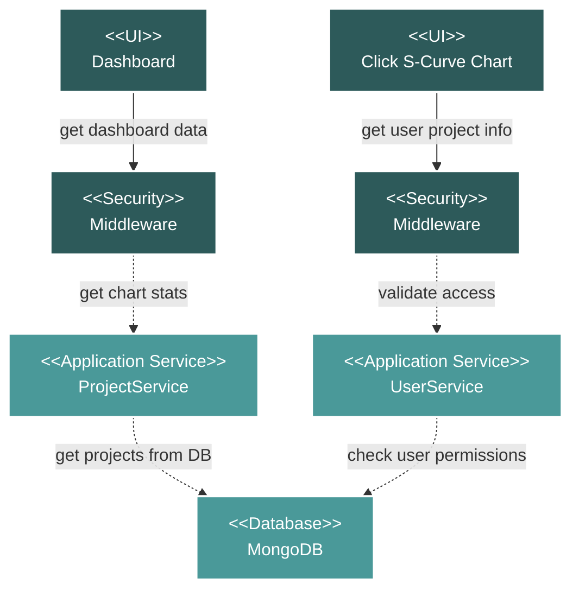

# Global Dashboard Module Flow Diagram

```mermaid
flowchart TD
    UI1["&lt;&lt;UI&gt;&gt;<br/>Dashboard"]
    UI2["&lt;&lt;UI&gt;&gt;<br/>Click S-Curve Chart"]

    SEC1["&lt;&lt;Security&gt;&gt;<br/>Middleware"]
    SEC2["&lt;&lt;Security&gt;&gt;<br/>Middleware"]

    AS1["&lt;&lt;Application Service&gt;&gt;<br/>ProjectService"]
    AS2["&lt;&lt;Application Service&gt;&gt;<br/>UserService"]

    DB1["&lt;&lt;Database&gt;&gt;<br/>MongoDB"]

    UI1 -->|get dashboard data| SEC1
    SEC1 -.->|get chart stats| AS1
    AS1 -.->|get projects from DB| DB1

    UI2 -->|get user project info| SEC2
    SEC2 -.->|validate access| AS2
    AS2 -.->|check user permissions| DB1

    %% Styling
    classDef uiClass fill:#2d5a5a,stroke:#fff,stroke-width:2px,color:#fff
    classDef secClass fill:#2d5a5a,stroke:#fff,stroke-width:2px,color:#fff
    classDef appClass fill:#4a9999,stroke:#fff,stroke-width:2px,color:#fff
    classDef dbClass fill:#4a9999,stroke:#fff,stroke-width:2px,color:#fff

    class UI1,UI2 uiClass
    class SEC1,SEC2 secClass
    class AS1,AS2 appClass
    class DB1 dbClass
```
