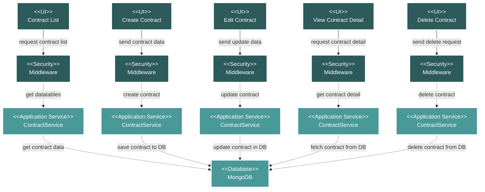

# Project Commercial Contract Module Flow Diagram

## Module Description

The **Contract** module within the Commercial section is designed to manage all contractual documents related to the project. It allows users to upload, track, and manage contracts and their associated metadata.

### Key Features:
- **Contract Listing**: A centralized data table displays all project contracts, with details like document number, name, description, and tags.
- **CRUD Operations**: Provides full capabilities to Create, Read, Update, and Delete contracts.
- **File Attachments**: Supports uploading, downloading, and managing contract document files.
- **Search and Filter**: Allows users to easily find contracts through searching and filtering on various attributes.

### Data Flow:
1.  **UI Request**: An action is initiated from the Vue.js frontend (e.g., listing contracts, creating a new one).
2.  **Security**: The request is validated by a middleware layer for authentication and authorization.
3.  **Service Processing**: The `ContractService` handles the core business logic for the requested action.
4.  **Database Interaction**: The service performs the necessary operations on the MongoDB database.
5.  **Response**: A response is sent back to the frontend, which updates the view for the user.

### Technical Components:
-   **Frontend**: Vue.js components for listing, creating, editing, and viewing contracts.
-   **Backend**: A Laravel API with a `ContractController` and `ContractService`.
-   **Database**: MongoDB for storing contract metadata and file paths.
-   **Security**: Standard Laravel middleware for protecting API routes.
