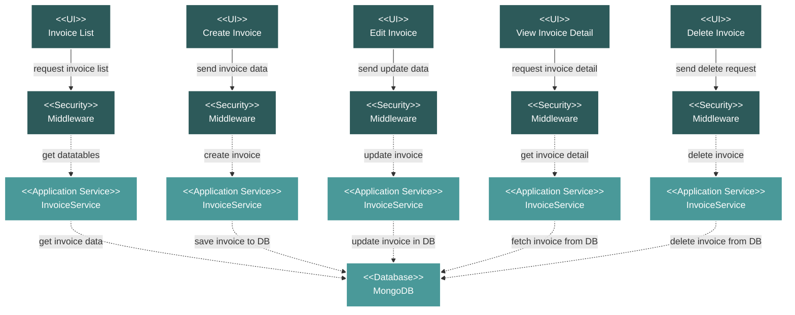

# Project Commercial Invoices Module Flow Diagram

## Module Description

The **Invoices** module handles the creation and management of project invoices. It allows for tracking financial transactions, linking them to specific Scopes of Work (SOW), and managing their payment status.

### Key Features:
- **Invoice Listing**: A comprehensive data table view of all project invoices, showing details like invoice number, date, SOW, value, and status.
- **CRUD Operations**: Full capabilities to Create, Read, Update, and Delete invoices.
- **Status Tracking**: Allows for tracking the payment status of each invoice (e.g., Unpaid, Paid).
- **File Management**: Supports attaching and downloading invoice documents.

### Data Flow:
1.  **UI Request**: An action is initiated from the Vue.js frontend.
2.  **Security**: The request is validated by a middleware layer.
3.  **Service Processing**: The `InvoiceService` handles the business logic for the requested action.
4.  **Database Interaction**: The service performs the necessary CRUD operations on the MongoDB database.
5.  **Response**: The service returns a response to the frontend, which updates the UI.

### Technical Components:
-   **Frontend**: Vue.js components for listing, creating, editing, and viewing invoices.
-   **Backend**: A Laravel API with an `InvoiceController` and `InvoiceService`.
-   **Database**: MongoDB for storing all invoice data.
-   **Security**: Standard Laravel middleware for API route protection.
