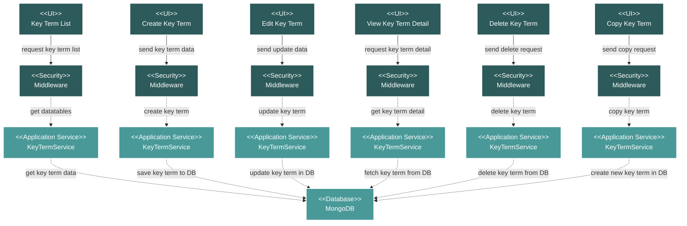

# Project Commercial Key Terms Module Flow Diagram

## Module Description

The **Key Terms** module is used to define and manage important contractual or project-specific terms. It allows for the storage of various data types (text, date, numeric, duration) associated with a specific term.

### Key Features:
- **Key Term Listing**: A data table view of all defined key terms and their values.
- **CRUD and Copy Operations**: Full capabilities to Create, Read, Update, Delete, and Copy key terms.
- **Typed Information**: Supports different data types for the 'value' of a key term, providing flexibility.
- **Search and Filter**: Allows users to search and filter the list of key terms.

### Data Flow:
1.  **UI Request**: An action is initiated from the Vue.js frontend.
2.  **Security**: The request passes through a middleware layer for validation.
3.  **Service Processing**: The `KeyTermService` handles the business logic, including data type conversions.
4.  **Database Interaction**: The service performs the necessary CRUD operations on the MongoDB database.
5.  **Response**: The service returns a response to the frontend, which updates the UI.

### Technical Components:
-   **Frontend**: Vue.js components for listing, creating, and editing key terms.
-   **Backend**: A Laravel API with a `KeyTermController` and `KeyTermService`.
-   **Database**: MongoDB for storing key term data.
-   **Security**: Standard Laravel middleware for API route protection.
