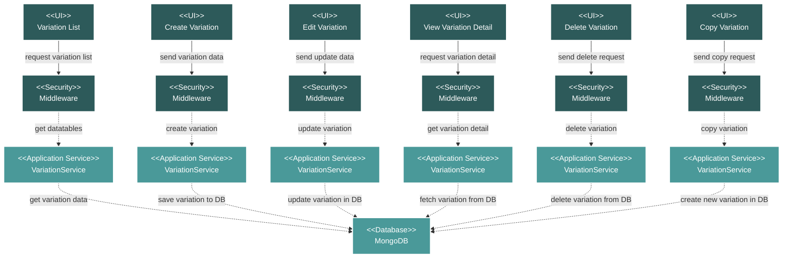

# Project Commercial Variation List Module Flow Diagram

## Module Description

The **Variation List** module manages variation orders within the project's commercial scope. It allows for the tracking of changes, additions, or modifications to the original contract.

### Key Features:
- **Variation Listing**: A data table view of all variation orders, including details like variation number, document name, date, and description.
- **CRUD and Copy Operations**: Full capabilities to Create, Read, Update, Delete, and Copy variation orders.
- **File Management**: Supports attaching and downloading relevant documents for each variation.
- **Search and Filter**: Provides tools to search and filter through the list of variations.

### Data Flow:
1.  **UI Request**: An action is initiated from the Vue.js frontend.
2.  **Security**: The request passes through a middleware layer for validation.
3.  **Service Processing**: The `VariationService` handles the business logic for the requested action (e.g., creating, deleting, copying).
4.  **Database Interaction**: The service performs the necessary operations on the MongoDB database.
5.  **Response**: The service returns a response to the frontend, which updates the UI.

### Technical Components:
-   **Frontend**: A suite of Vue.js components for listing, creating, editing, viewing, and copying variations.
-   **Backend**: A Laravel API with a `VariationController` and `VariationService`.
-   **Database**: MongoDB for storing variation order data and document metadata.
-   **Security**: Standard Laravel middleware for API route protection.
