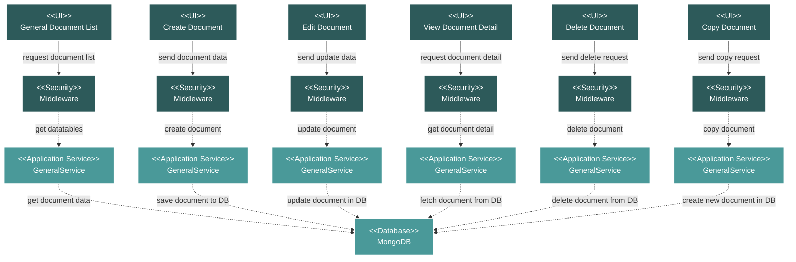

# Project Documentation General Module Flow Diagram

## Module Description

The **General Documentation** module provides a repository for managing various project-related documents that do not fit into other specific categories. It allows for the uploading, tagging, and tracking of general documents.

### Key Features:
- **Document Listing**: A data table view of all general documents, showing details like document number, name, date, and description.
- **CRUD and Copy Operations**: Full capabilities to Create, Read, Update, Delete, and Copy documents.
- **Tagging**: Allows for the categorization of documents using tags.
- **File Management**: Supports attaching and downloading document files.

### Data Flow:
1.  **UI Request**: An action is initiated from the Vue.js frontend.
2.  **Security**: The request is validated by a middleware layer.
3.  **Service Processing**: The `GeneralService` handles the business logic for the requested action.
4.  **Database Interaction**: The service performs the necessary CRUD operations on the MongoDB database.
5.  **Response**: The service returns a response to the frontend, which updates the UI.

### Technical Components:
-   **Frontend**: A suite of Vue.js components for listing, creating, editing, and viewing general documents.
-   **Backend**: A Laravel API with a `GeneralController` and `GeneralService`.
-   **Database**: MongoDB for storing document data and metadata.
-   **Security**: Standard Laravel middleware for API route protection.
