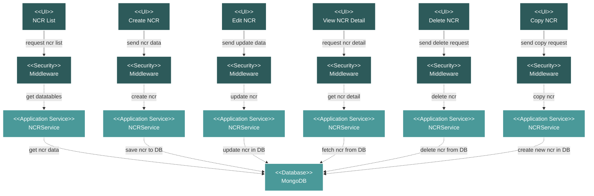

# Project Documentation NCR Module Flow Diagram

## Module Description

The **NCR (Non-Conformance Report)** module is used to document and track any deviations from the specified requirements or standards during the project. It provides a formal process for managing non-conformances.

### Key Features:
- **NCR Listing**: A data table view of all Non-Conformance Reports, showing details like reference number, document name, date, and status.
- **CRUD and Copy Operations**: Full capabilities to Create, Read, Update, Delete, and Copy NCRs.
- **Status Tracking**: Allows for tracking the status of each NCR (e.g., In Progress, Completed).
- **File Management**: Supports attaching and downloading relevant evidence or documentation.

### Data Flow:
1.  **UI Request**: An action is initiated from the Vue.js frontend.
2.  **Security**: The request is validated by a middleware layer.
3.  **Service Processing**: The `NCRService` handles the core business logic.
4.  **Database Interaction**: The service performs the necessary CRUD operations on the MongoDB database.
5.  **Response**: The service returns a response to the frontend, which updates the UI.

### Technical Components:
-   **Frontend**: A suite of Vue.js components for managing NCRs.
-   **Backend**: A Laravel API with an `NCRController` and `NCRService`.
-   **Database**: MongoDB for storing all NCR data.
-   **Security**: Standard Laravel middleware for API route protection.
