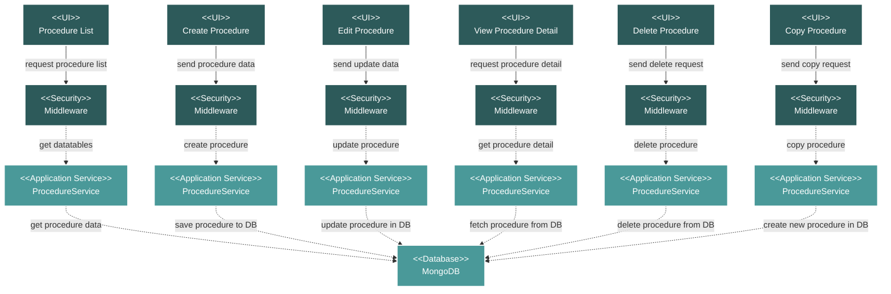

# Project Documentation Procedures Module Flow Diagram

## Module Description

The **Procedures** module within the Documentation section is used for managing project-specific procedures and instructions. It provides a centralized place to store, track, and distribute procedural documents.

### Key Features:
- **Procedure Listing**: A data table view of all project procedures, showing details like document number, name, date, and description.
- **CRUD and Copy Operations**: Full capabilities to Create, Read, Update, Delete, and Copy procedures.
- **Tagging**: Allows for the categorization of procedures for better organization.
- **File Management**: Supports attaching and downloading procedure documents.

### Data Flow:
1.  **UI Request**: An action is initiated from the Vue.js frontend.
2.  **Security**: The request is validated by a middleware layer.
3.  **Service Processing**: The `ProcedureService` handles the core business logic.
4.  **Database Interaction**: The service performs the necessary CRUD operations on the MongoDB database.
5.  **Response**: The service returns a response to the frontend, which updates the UI.

### Technical Components:
-   **Frontend**: A suite of Vue.js components for managing procedures.
-   **Backend**: A Laravel API with a `ProcedureController` and `ProcedureService`.
-   **Database**: MongoDB for storing procedure metadata and file paths.
-   **Security**: Standard Laravel middleware for API route protection.
