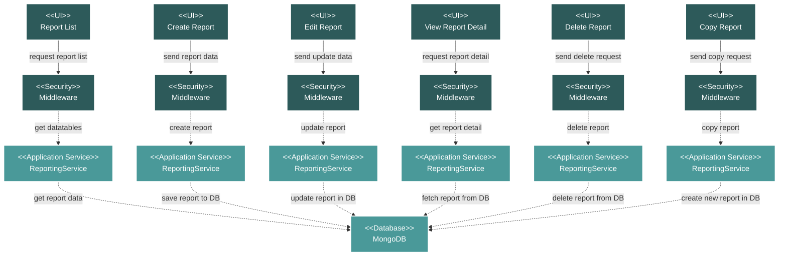

# Project Documentation Reporting Module Flow Diagram

## Module Description

The **Reporting** module within the Documentation section is used for managing and distributing formal project reports. It allows users to upload, categorize, and track various reports throughout the project lifecycle.

### Key Features:
- **Report Listing**: A data table view of all project reports, showing details like report name, date, description, and tags.
- **CRUD and Copy Operations**: Full capabilities to Create, Read, Update, Delete, and Copy reports.
- **Tagging**: Enables the categorization of reports for easier filtering and organization.
- **File Management**: Supports attaching and downloading report files.

### Data Flow:
1.  **UI Request**: An action is initiated from the Vue.js frontend.
2.  **Security**: The request is validated by a middleware layer.
3.  **Service Processing**: The `ReportingService` handles the core business logic.
4.  **Database Interaction**: The service performs the necessary CRUD operations on the MongoDB database.
5.  **Response**: The service returns a response to the frontend, which updates the UI.

### Technical Components:
-   **Frontend**: A suite of Vue.js components for managing reports.
-   **Backend**: A Laravel API with a `ReportingController` and `ReportingService`.
-   **Database**: MongoDB for storing report metadata and file paths.
-   **Security**: Standard Laravel middleware for API route protection.
