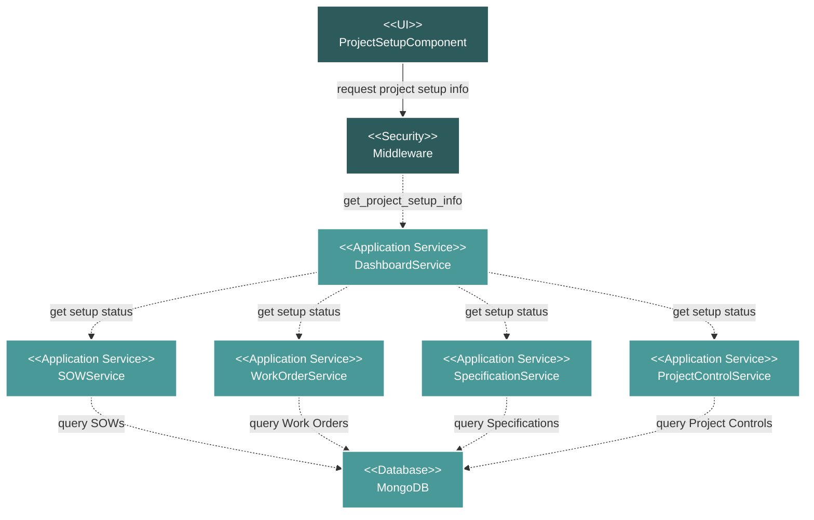

# Project Setup Module Flow Diagram

## Module Description

The **Project Setup** module acts as a centralized checklist to display the completion status of key project areas. It is a read-only view that aggregates data from multiple other modules to provide a high-level summary of project readiness.

### Key Features:
- **Aggregated View**: Displays the setup status for Scopes of Work (SOWs), Work Orders, Specifications, and Project Controls.
- **Status Summary**: For each area, it shows a count of completed items versus the total number of items (e.g., "5 out of 10 SOWs Submitted").
- **Direct Navigation**: Provides direct links to the detail or edit pages of incomplete items, allowing users to quickly address missing setup.

### Data Flow:
1.  **UI Request**: The `ProjectSetupComponent` requests the project setup information.
2.  **Primary Service**: The request is handled by the `DashboardService`, which acts as an orchestrator.
3.  **Data Aggregation**: The `DashboardService` calls the `getProjectSetupInfo` method on several other services (`SOWService`, `WorkOrderService`, `SpecificationService`, `ProjectControlService`).
4.  **Database Queries**: Each of these sub-services queries the MongoDB database to get the status and count of its respective items.
5.  **Response**: The aggregated summary data is returned to the UI for display.

### Technical Components:
-   **Frontend**: A single Vue.js component (`ProjectSetupComponent`) to display the checklist.
-   **Backend**: The `DashboardService` orchestrates calls to multiple other services to gather the required data.
-   **Database**: MongoDB is queried by the various sub-services.
-   **Security**: Standard Laravel middleware protects the API endpoint.
