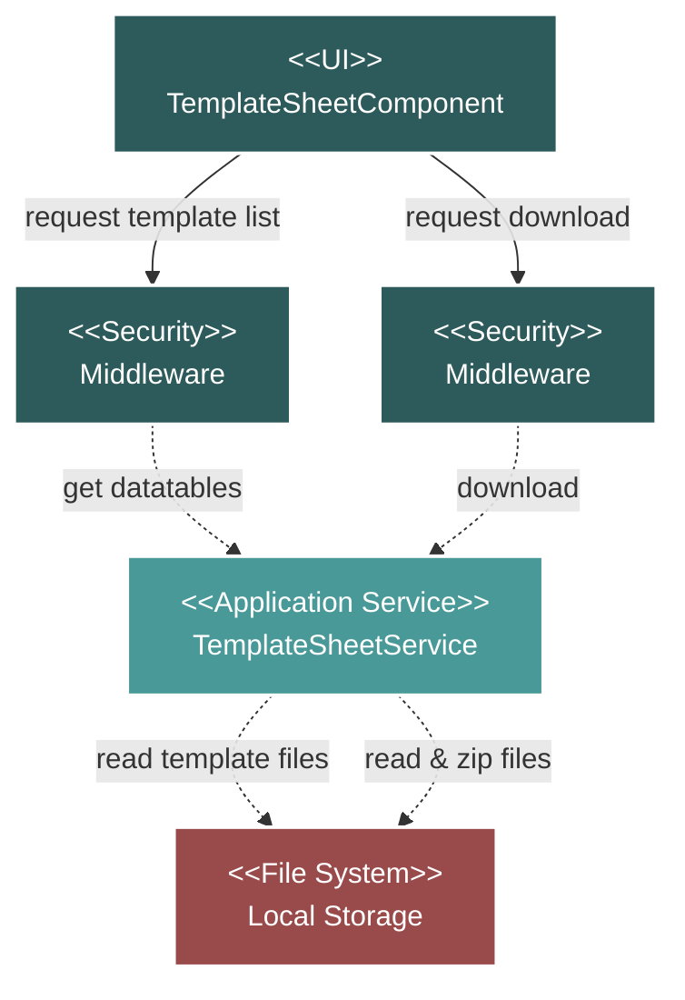

# Project Setup Template Sheet Module Flow Diagram

## Module Description

The **Template Sheet** module provides a centralized location for users to download predefined template files for various project activities. This module is read-only and interacts with the local file system, not the database.

### Key Features:
- **Template Listing**: Displays a list of available template sheets, grouped by activity (e.g., Manufacturing, Coating).
- **File Download**: Allows users to download individual template files or select multiple files to download as a single zip archive.

### Data Flow:
1.  **List Request**: The UI requests the list of templates.
2.  **Service Processing**: The `TemplateSheetService` reads a predefined configuration constant (`TEMPLATE_SHEET`) to identify the available templates.
3.  **File System Interaction**: The service checks the local file system for the existence and last-modified date of each template file.
4.  **Response**: The service returns the structured list of activities and their associated templates to the UI.
5.  **Download Request**: The user initiates a download for one or more files.
6.  **File Handling**: The `TemplateSheetService` retrieves the requested file(s) from the file system. If multiple files are requested, it creates a zip archive before sending the download response.

### Technical Components:
-   **Frontend**: A single Vue.js component (`TemplateSheetComponent`) to list and select templates.
-   **Backend**: The `TemplateSheetService` handles file system interactions and zipping.
-   **Storage**: Relies on the local server file system to store the template files.
-   **Security**: Standard Laravel middleware protects the API endpoints.
