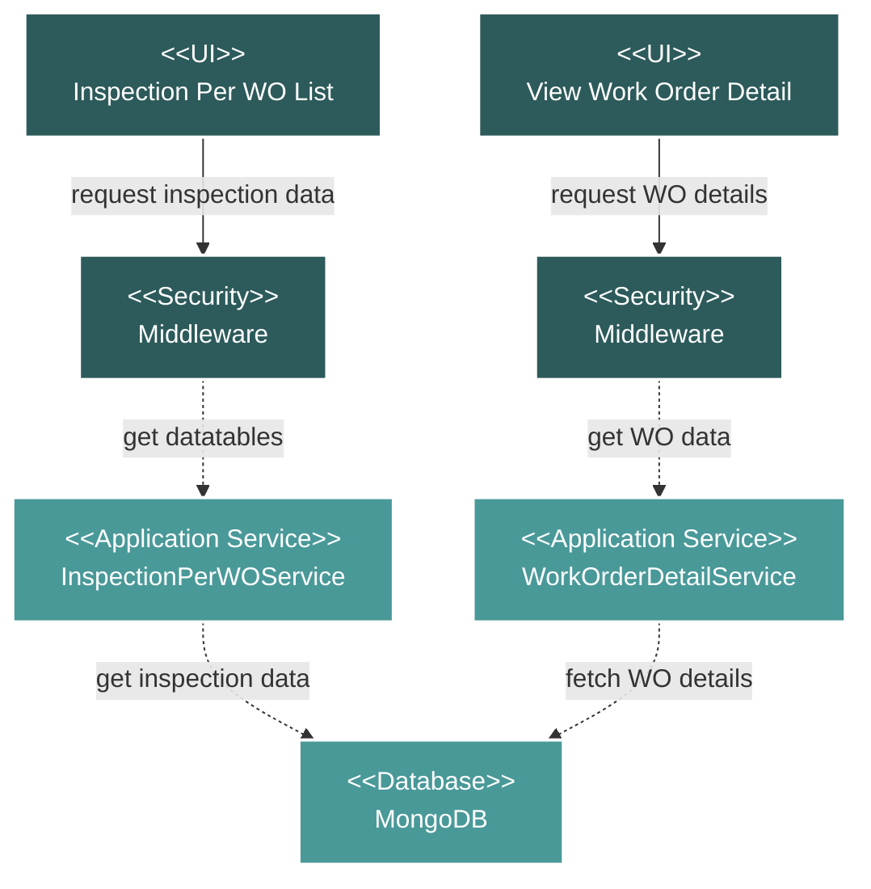

# Project Inspection Per WO Module Flow Diagram

## Module Description

The **Inspection Per WO** module provides a comprehensive view of work orders that require inspection, displaying detailed information about manufacturing and coating processes.

### Key Features:
- **Work Order Listing**: Displays work orders with item descriptions, vendors, activities, quantities, specifications, and related SOW
- **Data Aggregation**: The service layer aggregates data from multiple database collections (WorkOrder, Item, Mill, SOW, Specification)
- **Advanced Sorting**: Custom sorting logic with priority-based ordering for related SOW
- **Process Filtering**: Filters work orders by production and coating processes
- **Navigation**: Direct navigation to detailed work order views

### Data Flow:
1. **UI Request**: Vue component requests inspection data via datatables endpoint
2. **Service Processing**: InspectionPerWOService processes the request and queries the database
3. **Data Aggregation**: Service combines data from work orders, items, manufacturers, specifications, and SOW from the database
4. **Priority Calculation**: Applies custom priority logic for sorting related SOW items
5. **Response**: Returns formatted data with inspection details for display

### Technical Components:
- **Frontend**: Vue.js component with DataTable integration
- **Backend**: Laravel service with repository pattern
- **Database**: MongoDB for data persistence
- **Security**: Middleware layer for request validation
