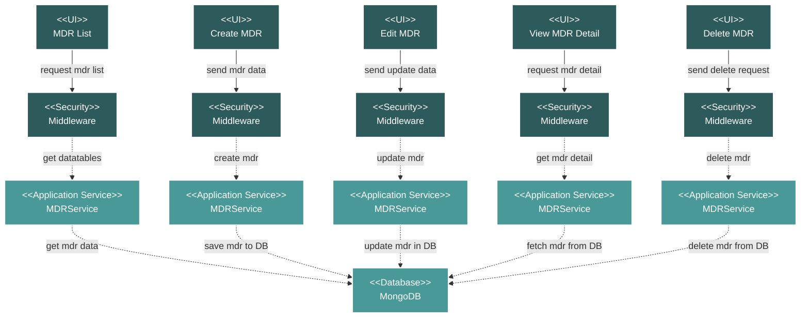

# Project Technical MDR Module Flow Diagram

## Module Description

The **MDR (Master Document Register)** module is used to manage and track all project-related documents. It provides a centralized repository for creating, viewing, updating, and deleting documents and their various revisions.

### Key Features:
- **Document Listing**: Displays a comprehensive list of all MDR documents with details like reference numbers, revision numbers, and status.
- **CRUD Operations**: Full capabilities to Create, Read, Update, and Delete MDR documents.
- **SOW Linking**: Ability to link MDR documents to specific Scope of Work (SOW) items.
- **File Management**: Supports uploading and downloading document attachments.

### Data Flow:
1.  **UI Request**: A request is initiated from the Vue.js frontend for an action (e.g., list, create, delete).
2.  **Security**: The request passes through a middleware layer for authentication and authorization.
3.  **Service Processing**: The `MDRService` handles the business logic, processing the request and interacting with the database.
4.  **Database Interaction**: The service performs the necessary operations (query, insert, update, delete) on the MongoDB database.
5.  **Response**: The service returns a response to the frontend, which then updates the UI accordingly.

### Technical Components:
-   **Frontend**: Vue.js components, including a data table for the list view and modals for creation/editing.
-   **Backend**: A Laravel-based API with a dedicated `MDRController` and `MDRService`.
-   **Database**: MongoDB for storing all MDR data and document metadata.
-   **Security**: Standard Laravel middleware for API route protection.
